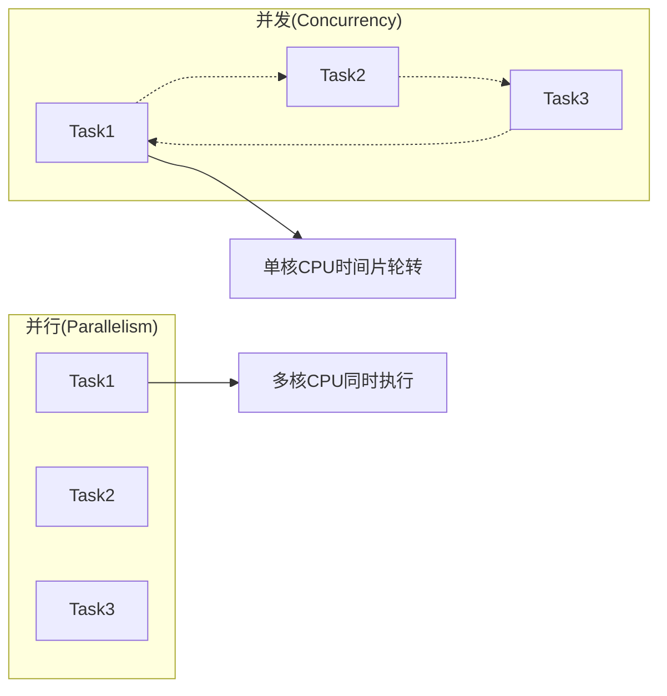
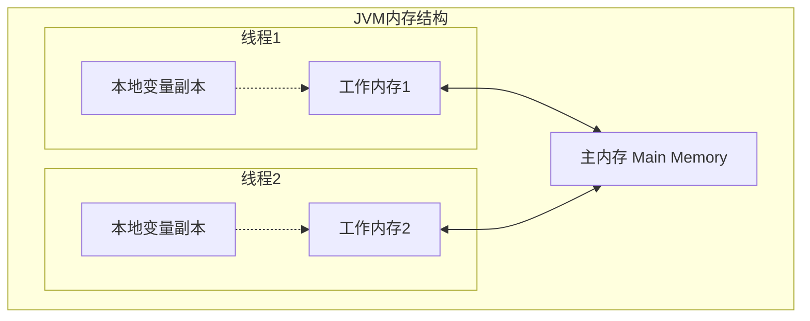
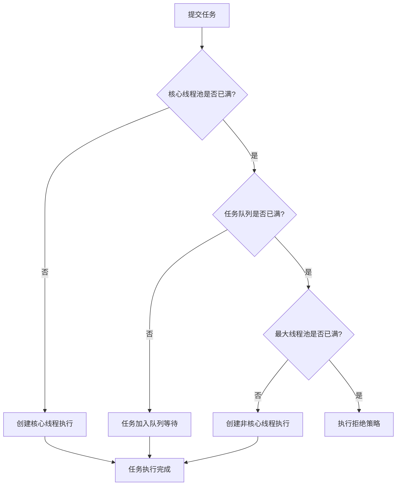

# Java并发编程深度解析：从理论到实践

> 🧵 **并发编程核心要点**
> - 深入理解Java内存模型和happens-before原则
> - 掌握synchronized、volatile、Lock等同步机制
> - 熟练运用线程池和并发工具类
> - 了解常见并发问题的原因和解决方案
> - 学习高性能并发编程的最佳实践

## 🎯 为什么需要并发编程？

在现代计算机系统中，CPU通常拥有多个核心，为了充分利用硬件资源，提升程序性能，我们需要让程序能够同时执行多个任务。这就是并发编程的核心价值。

### 并发 vs 并行



## 🧠 Java内存模型 (JMM)

### 内存模型基础



### Happens-Before规则

```java
public class HappensBeforeExample {
    private int x = 0;
    private volatile boolean flag = false;
    
    // 线程1执行
    public void writer() {
        x = 42;           // 1
        flag = true;      // 2
    }
    
    // 线程2执行
    public void reader() {
        if (flag) {       // 3
            int y = x;    // 4, y的值一定是42
        }
    }
}
```

**分析**：由于`flag`是volatile变量，操作2 happens-before 操作3，而操作1在操作2之前，操作4在操作3之后，所以操作1 happens-before 操作4。

## 🔐 同步机制详解

### 1. synchronized关键字

```java
public class SynchronizedExample {
    private int count = 0;
    private final Object lock = new Object();
    
    // 同步方法
    public synchronized void increment1() {
        count++;
    }
    
    // 同步代码块 - 实例锁
    public void increment2() {
        synchronized (this) {
            count++;
        }
    }
    
    // 同步代码块 - 私有锁
    public void increment3() {
        synchronized (lock) {
            count++;
        }
    }
    
    // 静态同步方法 - 类锁
    public static synchronized void staticMethod() {
        // 静态操作
    }
}
```

#### synchronized底层实现

```java
// 编译后的字节码（简化版）
public void increment() {
    // monitorenter  // 获取锁
    count++;
    // monitorexit   // 释放锁
}
```

### 2. volatile关键字

```java
public class VolatileExample {
    private volatile boolean running = true;
    private volatile int counter = 0;
    
    public void stop() {
        running = false;  // 立即对所有线程可见
    }
    
    public void run() {
        while (running) {
            // 执行任务
            counter++;    // 注意：volatile不保证原子性
        }
    }
    
    // 错误示例：volatile不能保证复合操作的原子性
    private volatile int volatileCount = 0;
    
    public void wrongIncrement() {
        volatileCount++;  // 这不是原子操作！包含读取、计算、写入三步
    }
    
    // 正确做法：使用AtomicInteger
    private final AtomicInteger atomicCount = new AtomicInteger(0);
    
    public void correctIncrement() {
        atomicCount.incrementAndGet();  // 这是原子操作
    }
}
```

### 3. Lock接口和ReentrantLock

```java
public class LockExample {
    private final ReentrantLock lock = new ReentrantLock();
    private final Condition condition = lock.newCondition();
    private int count = 0;
    
    public void increment() {
        lock.lock();
        try {
            count++;
            condition.signalAll();  // 唤醒等待的线程
        } finally {
            lock.unlock();  // 确保在finally块中释放锁
        }
    }
    
    public void waitForCondition() throws InterruptedException {
        lock.lock();
        try {
            while (count < 10) {
                condition.await();  // 等待条件满足
            }
            // 条件满足后的处理逻辑
        } finally {
            lock.unlock();
        }
    }
    
    // 可中断的锁获取
    public void interruptibleLock() throws InterruptedException {
        if (lock.tryLock(5, TimeUnit.SECONDS)) {  // 尝试获取锁，最多等待5秒
            try {
                // 执行临界区代码
            } finally {
                lock.unlock();
            }
        } else {
            throw new RuntimeException("无法获取锁");
        }
    }
}
```

#### ReentrantLock vs synchronized

| 特性 | synchronized | ReentrantLock |
|------|--------------|---------------|
| **使用简便性** | 🟢 简单 | 🟡 需要手动管理 |
| **功能丰富性** | 🟡 基础功能 | 🟢 功能丰富 |
| **性能** | 🟢 JVM优化 | 🟡 相当 |
| **可中断性** | ❌ 不支持 | ✅ 支持 |
| **公平锁** | ❌ 不支持 | ✅ 支持 |
| **条件变量** | ❌ 单一wait/notify | ✅ 多个Condition |

## 🧵 线程池详解

### ThreadPoolExecutor参数解析

```java
public class ThreadPoolExample {
    
    public static void main(String[] args) {
        // 自定义线程池
        ThreadPoolExecutor executor = new ThreadPoolExecutor(
            5,                              // corePoolSize: 核心线程数
            10,                             // maximumPoolSize: 最大线程数
            60L,                            // keepAliveTime: 空闲线程存活时间
            TimeUnit.SECONDS,               // unit: 时间单位
            new ArrayBlockingQueue<>(100),  // workQueue: 任务队列
            new ThreadPoolExecutor.CallerRunsPolicy()  // handler: 拒绝策略
        );
        
        // 提交任务
        for (int i = 0; i < 20; i++) {
            final int taskNum = i;
            executor.submit(() -> {
                System.out.println("执行任务 " + taskNum + 
                    " - 线程: " + Thread.currentThread().getName());
                try {
                    Thread.sleep(2000);
                } catch (InterruptedException e) {
                    Thread.currentThread().interrupt();
                }
            });
        }
        
        // 优雅关闭
        executor.shutdown();
        try {
            if (!executor.awaitTermination(60, TimeUnit.SECONDS)) {
                executor.shutdownNow();
            }
        } catch (InterruptedException e) {
            executor.shutdownNow();
        }
    }
}
```

### 线程池执行流程



### 常用拒绝策略

```java
public class RejectionPolicyExample {
    
    // 1. CallerRunsPolicy - 调用者运行
    ThreadPoolExecutor executor1 = new ThreadPoolExecutor(
        2, 4, 60L, TimeUnit.SECONDS,
        new ArrayBlockingQueue<>(2),
        new ThreadPoolExecutor.CallerRunsPolicy()  // 主线程执行被拒绝的任务
    );
    
    // 2. AbortPolicy - 抛出异常（默认）
    ThreadPoolExecutor executor2 = new ThreadPoolExecutor(
        2, 4, 60L, TimeUnit.SECONDS,
        new ArrayBlockingQueue<>(2),
        new ThreadPoolExecutor.AbortPolicy()  // 抛出RejectedExecutionException
    );
    
    // 3. DiscardPolicy - 静默丢弃
    ThreadPoolExecutor executor3 = new ThreadPoolExecutor(
        2, 4, 60L, TimeUnit.SECONDS,
        new ArrayBlockingQueue<>(2),
        new ThreadPoolExecutor.DiscardPolicy()  // 直接丢弃任务，不抛异常
    );
    
    // 4. DiscardOldestPolicy - 丢弃最旧的
    ThreadPoolExecutor executor4 = new ThreadPoolExecutor(
        2, 4, 60L, TimeUnit.SECONDS,
        new ArrayBlockingQueue<>(2),
        new ThreadPoolExecutor.DiscardOldestPolicy()  // 丢弃队列头部最旧的任务
    );
    
    // 5. 自定义拒绝策略
    ThreadPoolExecutor executor5 = new ThreadPoolExecutor(
        2, 4, 60L, TimeUnit.SECONDS,
        new ArrayBlockingQueue<>(2),
        (task, executor) -> {
            // 自定义处理逻辑，如记录日志、降级处理等
            System.err.println("任务被拒绝: " + task.toString());
            // 可以选择将任务存储到数据库或消息队列中
        }
    );
}
```

## 🛠️ 并发工具类

### 1. CountDownLatch - 倒计时门闩

```java
public class CountDownLatchExample {
    
    public static void main(String[] args) throws InterruptedException {
        int numTasks = 3;
        CountDownLatch latch = new CountDownLatch(numTasks);
        
        // 启动多个任务
        for (int i = 0; i < numTasks; i++) {
            final int taskId = i;
            new Thread(() -> {
                try {
                    System.out.println("任务 " + taskId + " 开始执行");
                    Thread.sleep(1000 + taskId * 500);  // 模拟任务执行
                    System.out.println("任务 " + taskId + " 执行完成");
                } catch (InterruptedException e) {
                    Thread.currentThread().interrupt();
                } finally {
                    latch.countDown();  // 完成一个任务，计数减1
                }
            }).start();
        }
        
        // 等待所有任务完成
        System.out.println("等待所有任务完成...");
        latch.await();
        System.out.println("所有任务已完成！");
    }
}
```

### 2. CyclicBarrier - 循环栅栏

```java
public class CyclicBarrierExample {
    
    public static void main(String[] args) {
        int numThreads = 3;
        
        CyclicBarrier barrier = new CyclicBarrier(numThreads, () -> {
            System.out.println("所有线程都到达栅栏，开始执行汇总操作！");
        });
        
        for (int i = 0; i < numThreads; i++) {
            final int threadId = i;
            new Thread(() -> {
                try {
                    // 第一阶段工作
                    System.out.println("线程 " + threadId + " 完成第一阶段工作");
                    Thread.sleep(1000 + threadId * 200);
                    
                    barrier.await();  // 等待其他线程完成第一阶段
                    
                    // 第二阶段工作
                    System.out.println("线程 " + threadId + " 开始第二阶段工作");
                    Thread.sleep(500);
                    System.out.println("线程 " + threadId + " 完成第二阶段工作");
                    
                } catch (InterruptedException | BrokenBarrierException e) {
                    e.printStackTrace();
                }
            }).start();
        }
    }
}
```

### 3. Semaphore - 信号量

```java
public class SemaphoreExample {
    private static final Semaphore semaphore = new Semaphore(3);  // 允许3个线程同时执行
    
    public static void main(String[] args) {
        for (int i = 0; i < 10; i++) {
            final int taskId = i;
            new Thread(() -> accessResource(taskId)).start();
        }
    }
    
    private static void accessResource(int taskId) {
        try {
            System.out.println("任务 " + taskId + " 等待获取许可证...");
            semaphore.acquire();  // 获取许可证
            
            System.out.println("任务 " + taskId + " 获得许可证，开始执行");
            Thread.sleep(2000);  // 模拟资源使用
            System.out.println("任务 " + taskId + " 执行完成，释放许可证");
            
        } catch (InterruptedException e) {
            Thread.currentThread().interrupt();
        } finally {
            semaphore.release();  // 释放许可证
        }
    }
}
```

### 4. 原子类家族

```java
public class AtomicExample {
    
    // 基本类型原子类
    private final AtomicInteger counter = new AtomicInteger(0);
    private final AtomicLong longCounter = new AtomicLong(0);
    private final AtomicBoolean flag = new AtomicBoolean(false);
    
    // 数组类型原子类
    private final AtomicIntegerArray array = new AtomicIntegerArray(10);
    
    // 引用类型原子类
    private final AtomicReference<User> userRef = new AtomicReference<>();
    
    public void basicAtomicOperations() {
        // 基本操作
        int oldValue = counter.get();                    // 获取当前值
        int newValue = counter.incrementAndGet();        // 原子递增并返回新值
        boolean success = counter.compareAndSet(1, 2);   // CAS操作
        
        // 数组操作
        array.set(0, 100);                              // 设置指定位置的值
        int arrayValue = array.getAndIncrement(0);       // 原子递增指定位置
        
        // 自定义更新逻辑
        counter.updateAndGet(current -> current * 2);    // 当前值乘以2
        counter.accumulateAndGet(10, Integer::sum);      // 当前值加10
    }
    
    // 自定义原子操作
    public void customAtomicOperation() {
        AtomicReference<Node> head = new AtomicReference<>();
        
        // 无锁栈的push操作
        Node newNode = new Node("data");
        Node currentHead;
        do {
            currentHead = head.get();
            newNode.next = currentHead;
        } while (!head.compareAndSet(currentHead, newNode));
    }
    
    static class User {
        String name;
        int age;
        
        User(String name, int age) {
            this.name = name;
            this.age = age;
        }
    }
    
    static class Node {
        String data;
        Node next;
        
        Node(String data) {
            this.data = data;
        }
    }
}
```

## 🚨 常见并发问题和解决方案

### 1. 死锁问题

```java
public class DeadlockExample {
    private final Object lock1 = new Object();
    private final Object lock2 = new Object();
    
    // 可能发生死锁的代码
    public void method1() {
        synchronized (lock1) {
            System.out.println("方法1获得lock1");
            try { Thread.sleep(100); } catch (InterruptedException e) {}
            
            synchronized (lock2) {
                System.out.println("方法1获得lock2");
            }
        }
    }
    
    public void method2() {
        synchronized (lock2) {
            System.out.println("方法2获得lock2");
            try { Thread.sleep(100); } catch (InterruptedException e) {}
            
            synchronized (lock1) {
                System.out.println("方法2获得lock1");
            }
        }
    }
    
    // 解决方案1：统一获取锁的顺序
    public void safeMethod1() {
        synchronized (lock1) {
            synchronized (lock2) {
                // 业务逻辑
            }
        }
    }
    
    public void safeMethod2() {
        synchronized (lock1) {  // 与method1保持相同的锁顺序
            synchronized (lock2) {
                // 业务逻辑
            }
        }
    }
    
    // 解决方案2：使用tryLock设置超时
    private final ReentrantLock reentrantLock1 = new ReentrantLock();
    private final ReentrantLock reentrantLock2 = new ReentrantLock();
    
    public void timeoutMethod() {
        boolean lock1Acquired = false;
        boolean lock2Acquired = false;
        
        try {
            lock1Acquired = reentrantLock1.tryLock(1, TimeUnit.SECONDS);
            if (lock1Acquired) {
                lock2Acquired = reentrantLock2.tryLock(1, TimeUnit.SECONDS);
                if (lock2Acquired) {
                    // 执行业务逻辑
                }
            }
        } catch (InterruptedException e) {
            Thread.currentThread().interrupt();
        } finally {
            if (lock2Acquired) reentrantLock2.unlock();
            if (lock1Acquired) reentrantLock1.unlock();
        }
    }
}
```

### 2. 生产者-消费者问题

```java
public class ProducerConsumerExample {
    private final BlockingQueue<String> queue = new ArrayBlockingQueue<>(10);
    private final AtomicBoolean running = new AtomicBoolean(true);
    
    // 生产者
    class Producer implements Runnable {
        @Override
        public void run() {
            int count = 0;
            while (running.get()) {
                try {
                    String item = "Item-" + count++;
                    queue.put(item);  // 队列满时会阻塞
                    System.out.println("生产: " + item);
                    Thread.sleep(100);
                } catch (InterruptedException e) {
                    Thread.currentThread().interrupt();
                    break;
                }
            }
        }
    }
    
    // 消费者
    class Consumer implements Runnable {
        private final String name;
        
        Consumer(String name) {
            this.name = name;
        }
        
        @Override
        public void run() {
            while (running.get() || !queue.isEmpty()) {
                try {
                    String item = queue.poll(1, TimeUnit.SECONDS);  // 超时等待
                    if (item != null) {
                        System.out.println(name + " 消费: " + item);
                        Thread.sleep(150);  // 模拟处理时间
                    }
                } catch (InterruptedException e) {
                    Thread.currentThread().interrupt();
                    break;
                }
            }
        }
    }
    
    public void start() {
        // 启动1个生产者和2个消费者
        new Thread(new Producer()).start();
        new Thread(new Consumer("消费者1")).start();
        new Thread(new Consumer("消费者2")).start();
        
        // 10秒后停止
        new Thread(() -> {
            try {
                Thread.sleep(10000);
                running.set(false);
                System.out.println("停止生产消费");
            } catch (InterruptedException e) {
                Thread.currentThread().interrupt();
            }
        }).start();
    }
}
```

### 3. 缓存一致性问题

```java
public class CacheConsistencyExample {
    private final ConcurrentHashMap<String, String> cache = new ConcurrentHashMap<>();
    private final ReentrantReadWriteLock rwLock = new ReentrantReadWriteLock();
    
    // 问题版本：可能出现缓存不一致
    public String getValue(String key) {
        String value = cache.get(key);
        if (value == null) {
            // 这里可能有多个线程同时执行，造成重复计算
            value = expensiveOperation(key);
            cache.put(key, value);
        }
        return value;
    }
    
    // 解决方案1：使用读写锁
    public String getValueWithRWLock(String key) {
        // 先尝试读取
        rwLock.readLock().lock();
        try {
            String value = cache.get(key);
            if (value != null) {
                return value;
            }
        } finally {
            rwLock.readLock().unlock();
        }
        
        // 需要计算值，获取写锁
        rwLock.writeLock().lock();
        try {
            // 双重检查
            String value = cache.get(key);
            if (value == null) {
                value = expensiveOperation(key);
                cache.put(key, value);
            }
            return value;
        } finally {
            rwLock.writeLock().unlock();
        }
    }
    
    // 解决方案2：使用putIfAbsent
    public String getValueWithPutIfAbsent(String key) {
        return cache.computeIfAbsent(key, this::expensiveOperation);
    }
    
    // 解决方案3：使用Future避免重复计算
    private final ConcurrentHashMap<String, Future<String>> futureCache = new ConcurrentHashMap<>();
    
    public String getValueWithFuture(String key) throws ExecutionException, InterruptedException {
        Future<String> future = futureCache.get(key);
        if (future == null) {
            Callable<String> callable = () -> expensiveOperation(key);
            FutureTask<String> futureTask = new FutureTask<>(callable);
            future = futureCache.putIfAbsent(key, futureTask);
            if (future == null) {
                future = futureTask;
                futureTask.run();
            }
        }
        return future.get();
    }
    
    private String expensiveOperation(String key) {
        try {
            Thread.sleep(1000);  // 模拟耗时操作
            return "Value for " + key;
        } catch (InterruptedException e) {
            Thread.currentThread().interrupt();
            throw new RuntimeException(e);
        }
    }
}
```

## 🎯 性能优化最佳实践

### 1. 减少锁的粒度

```java
public class LockGranularityExample {
    
    // 粗粒度锁 - 不推荐
    private final Object lock = new Object();
    private int counter1 = 0;
    private int counter2 = 0;
    
    public void coarseGrainedLock() {
        synchronized (lock) {
            counter1++;
            counter2++;
            // 其他不相关的操作也被锁保护
        }
    }
    
    // 细粒度锁 - 推荐
    private final Object lock1 = new Object();
    private final Object lock2 = new Object();
    
    public void fineGrainedLock1() {
        synchronized (lock1) {
            counter1++;
        }
    }
    
    public void fineGrainedLock2() {
        synchronized (lock2) {
            counter2++;
        }
    }
}
```

### 2. 使用无锁数据结构

```java
public class LockFreeExample {
    
    // 无锁队列
    private final ConcurrentLinkedQueue<String> lockFreeQueue = new ConcurrentLinkedQueue<>();
    
    // 无锁Map
    private final ConcurrentHashMap<String, String> lockFreeMap = new ConcurrentHashMap<>();
    
    // 无锁计数器
    private final AtomicLong lockFreeCounter = new AtomicLong(0);
    
    public void lockFreeOperations() {
        // 队列操作
        lockFreeQueue.offer("item");
        String item = lockFreeQueue.poll();
        
        // Map操作
        lockFreeMap.put("key", "value");
        String value = lockFreeMap.get("key");
        
        // 计数器操作
        long count = lockFreeCounter.incrementAndGet();
    }
}
```

### 3. 合理使用ThreadLocal

```java
public class ThreadLocalExample {
    
    // 用于存储用户会话信息
    private static final ThreadLocal<UserSession> userSessionThreadLocal = new ThreadLocal<>();
    
    // 用于格式化日期（SimpleDateFormat不是线程安全的）
    private static final ThreadLocal<SimpleDateFormat> dateFormatThreadLocal = 
        ThreadLocal.withInitial(() -> new SimpleDateFormat("yyyy-MM-dd HH:mm:ss"));
    
    public void setUserSession(UserSession session) {
        userSessionThreadLocal.set(session);
    }
    
    public UserSession getCurrentUser() {
        return userSessionThreadLocal.get();
    }
    
    public String formatDate(Date date) {
        return dateFormatThreadLocal.get().format(date);
    }
    
    // 重要：使用完毕后要清理ThreadLocal
    public void cleanup() {
        userSessionThreadLocal.remove();
        dateFormatThreadLocal.remove();
    }
    
    static class UserSession {
        String userId;
        String userName;
        // 其他会话信息
    }
}
```

## 🔍 并发调试技巧

### 1. 线程转储分析

```java
public class ThreadDumpExample {
    
    public static void printThreadDump() {
        ThreadMXBean threadBean = ManagementFactory.getThreadMXBean();
        ThreadInfo[] threadInfos = threadBean.dumpAllThreads(true, true);
        
        for (ThreadInfo threadInfo : threadInfos) {
            System.out.println("线程名: " + threadInfo.getThreadName());
            System.out.println("线程状态: " + threadInfo.getThreadState());
            
            if (threadInfo.getLockName() != null) {
                System.out.println("等待锁: " + threadInfo.getLockName());
            }
            
            StackTraceElement[] stackTrace = threadInfo.getStackTrace();
            for (StackTraceElement element : stackTrace) {
                System.out.println("\t" + element);
            }
            System.out.println();
        }
    }
}
```

### 2. 并发测试工具

```java
public class ConcurrencyTestExample {
    private final AtomicInteger counter = new AtomicInteger(0);
    
    @Test
    public void testConcurrentIncrement() throws InterruptedException {
        int threadCount = 100;
        int operationsPerThread = 1000;
        CountDownLatch latch = new CountDownLatch(threadCount);
        
        for (int i = 0; i < threadCount; i++) {
            new Thread(() -> {
                try {
                    for (int j = 0; j < operationsPerThread; j++) {
                        counter.incrementAndGet();
                    }
                } finally {
                    latch.countDown();
                }
            }).start();
        }
        
        latch.await();
        
        // 验证结果
        int expected = threadCount * operationsPerThread;
        assertEquals(expected, counter.get());
    }
}
```

## 🚀 总结与最佳实践

### 并发编程金律

1. **优先使用并发工具类**：ConcurrentHashMap > synchronized HashMap
2. **减少锁的范围**：只锁必要的代码块
3. **避免嵌套锁**：防止死锁发生
4. **使用不可变对象**：天然线程安全
5. **合理使用线程池**：避免频繁创建销毁线程

### 性能优化checklist

- ✅ 使用合适的并发工具类
- ✅ 减少锁的竞争和粒度
- ✅ 避免不必要的同步
- ✅ 合理设置线程池参数
- ✅ 及时释放资源（如ThreadLocal）

### 常见误区

- ❌ 过度使用synchronized
- ❌ 忽略volatile的非原子性
- ❌ ThreadLocal内存泄漏
- ❌ 不合理的线程池配置

> 💡 **记住**：并发编程是一门艺术，需要在正确性、性能和复杂度之间找到平衡点。

---

## 📖 延伸阅读

- [JVM内存模型深度解析](../jvm-memory-model/)
- [分布式锁的设计与实现](../distributed-locks/)
- [高并发系统设计原理](../high-concurrency-system-design/)

---

**如果这篇文章对你有帮助，欢迎点赞分享！** ⭐
