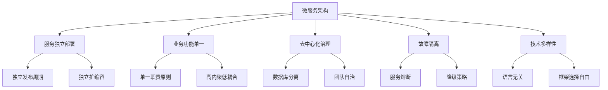
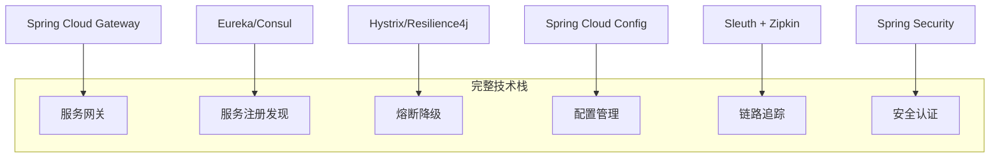
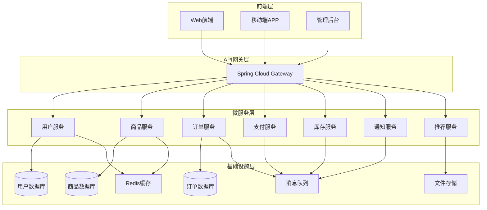

---
title: 微服务架构设计原理与最佳实践
date: 2025-11-15 10:30
updated: 2025-12-01 15:30
tags: [微服务,架构设计,分布式系统,Spring Cloud,Docker]
categories: [架构设计]
description: 从单体应用到微服务架构的完整演进指南，包含实践案例、技术选型和常见陷阱避免策略。
cover: https://cdn.jsdelivr.net/gh/nodejs/nodejs.dev@main/public/images/logos/nodejs-new-pantone-black.svg
sticky: 1
series: Java / 后端成长线
difficulty: intermediate
keywords: [微服务, 分布式系统, Spring Cloud]
hero_desc: 从单体到微服务的演进过程，适合放在 Java 基础和并发之后继续阅读。
recommended_next:
  - Git工作流与团队协作最佳实践
---

# 微服务架构设计原理与最佳实践

> 🚀 **本文将带你深入了解**
> - 微服务架构的核心理念和优势
> - 从单体应用向微服务的渐进式迁移策略
> - Spring Cloud生态系统完整解决方案
> - 分布式系统设计的关键考量点
> - 生产环境下的微服务治理实践

## 📚 目录概览

- [什么是微服务架构](#什么是微服务架构)
- [微服务vs单体应用对比](#微服务vs单体应用对比)
- [微服务设计原则](#微服务设计原则)
- [技术栈选型指南](#技术栈选型指南)
- [实战案例：电商系统微服务化](#实战案例)
- [常见陷阱与解决方案](#常见陷阱与解决方案)

## 🎯 什么是微服务架构

微服务架构是一种**分布式系统设计方法**，它将单一应用程序开发为一套小型服务，每个服务运行在自己的进程中，并使用轻量级机制（通常是HTTP资源API）进行通信。

### 核心特征



## ⚖️ 微服务vs单体应用对比

| 维度 | 单体应用 | 微服务架构 |
|------|----------|------------|
| **开发复杂度** | 🟢 简单 | 🟡 复杂 |
| **部署方式** | 🟢 简单 | 🟡 复杂 |
| **技术栈** | 🟡 统一 | 🟢 多样化 |
| **扩展性** | 🔴 整体扩展 | 🟢 按需扩展 |
| **故障影响** | 🔴 全局影响 | 🟢 局部隔离 |
| **团队协作** | 🟡 需要协调 | 🟢 独立开发 |
| **数据一致性** | 🟢 ACID事务 | 🔴 最终一致性 |

## 🏗️ 微服务设计原则

### 1. 单一职责原则 (Single Responsibility Principle)

每个微服务应该专注于一个业务能力，遵循"做一件事并做好"的原则。

```java
// ❌ 不好的设计 - 职责混乱
@Service
public class UserManagementService {
    public void createUser(User user) { /* 用户创建 */ }
    public void sendEmail(String email) { /* 邮件发送 */ }
    public void generateReport() { /* 报表生成 */ }
    public void processPayment(Payment payment) { /* 支付处理 */ }
}

// ✅ 好的设计 - 职责单一
@Service
public class UserService {
    public void createUser(User user) { /* 专注用户管理 */ }
    public void updateUser(User user) { /* */ }
    public User findUser(Long id) { /* */ }
}

@Service
public class NotificationService {
    public void sendEmail(String email) { /* 专注通知服务 */ }
    public void sendSms(String phone) { /* */ }
}
```

### 2. 数据库分离原则

```yaml
# 每个服务拥有独立的数据存储
services:
  user-service:
    database: user_db
    technology: PostgreSQL
    
  order-service:
    database: order_db
    technology: MySQL
    
  product-service:
    database: product_db
    technology: MongoDB
    
  analytics-service:
    database: analytics_db
    technology: Elasticsearch
```

### 3. 无状态设计

```java
// ✅ 无状态设计示例
@RestController
public class OrderController {
    
    @Autowired
    private OrderService orderService;
    
    @PostMapping("/orders")
    public ResponseEntity<Order> createOrder(@RequestBody CreateOrderRequest request, 
                                           @RequestHeader("Authorization") String token) {
        // 从token解析用户信息，不依赖session状态
        User user = jwtTokenUtil.parseUser(token);
        Order order = orderService.createOrder(request, user);
        return ResponseEntity.ok(order);
    }
}
```

## 🛠️ 技术栈选型指南

### Spring Cloud生态系统



### 容器化部署

```dockerfile
# Dockerfile 最佳实践
FROM openjdk:11-jre-slim

# 创建非root用户
RUN groupadd -r spring && useradd -r -g spring spring

# 设置工作目录
WORKDIR /app

# 复制jar包
COPY target/user-service-*.jar app.jar

# 健康检查
HEALTHCHECK --interval=30s --timeout=3s --start-period=5s --retries=3 \
  CMD curl -f http://localhost:8080/actuator/health || exit 1

# 切换到非root用户
USER spring:spring

# 启动应用
ENTRYPOINT ["java", "-jar", "/app/app.jar"]
```

## 🏪 实战案例：电商系统微服务化

### 系统架构图



### 服务拆分策略

#### 用户服务 (User Service)

```java
@RestController
@RequestMapping("/api/users")
public class UserController {
    
    @Autowired
    private UserService userService;
    
    @PostMapping("/register")
    public ResponseEntity<UserRegistrationResponse> register(
            @Valid @RequestBody UserRegistrationRequest request) {
        
        UserRegistrationResponse response = userService.registerUser(request);
        return ResponseEntity.status(HttpStatus.CREATED).body(response);
    }
    
    @GetMapping("/{userId}")
    public ResponseEntity<UserDetailResponse> getUserDetail(@PathVariable Long userId) {
        UserDetailResponse response = userService.getUserDetail(userId);
        return ResponseEntity.ok(response);
    }
    
    @PutMapping("/{userId}/profile")
    public ResponseEntity<Void> updateProfile(@PathVariable Long userId,
                                            @Valid @RequestBody UpdateProfileRequest request) {
        userService.updateProfile(userId, request);
        return ResponseEntity.ok().build();
    }
}

@Service
@Transactional
public class UserService {
    
    @Autowired
    private UserRepository userRepository;
    
    @Autowired
    private PasswordEncoder passwordEncoder;
    
    @Autowired
    private ApplicationEventPublisher eventPublisher;
    
    public UserRegistrationResponse registerUser(UserRegistrationRequest request) {
        // 验证用户名是否已存在
        if (userRepository.existsByUsername(request.getUsername())) {
            throw new UserAlreadyExistsException("用户名已存在");
        }
        
        // 创建新用户
        User user = User.builder()
                .username(request.getUsername())
                .email(request.getEmail())
                .passwordHash(passwordEncoder.encode(request.getPassword()))
                .status(UserStatus.ACTIVE)
                .createdAt(LocalDateTime.now())
                .build();
                
        User savedUser = userRepository.save(user);
        
        // 发布用户注册事件
        eventPublisher.publishEvent(new UserRegisteredEvent(savedUser.getId(), savedUser.getEmail()));
        
        return UserRegistrationResponse.from(savedUser);
    }
}
```

#### 订单服务 (Order Service)

```java
@RestController
@RequestMapping("/api/orders")
public class OrderController {
    
    @Autowired
    private OrderService orderService;
    
    @PostMapping
    public ResponseEntity<CreateOrderResponse> createOrder(
            @Valid @RequestBody CreateOrderRequest request,
            @RequestHeader("X-User-Id") Long userId) {
        
        CreateOrderResponse response = orderService.createOrder(request, userId);
        return ResponseEntity.status(HttpStatus.CREATED).body(response);
    }
    
    @GetMapping("/{orderId}")
    public ResponseEntity<OrderDetailResponse> getOrderDetail(@PathVariable String orderId) {
        OrderDetailResponse response = orderService.getOrderDetail(orderId);
        return ResponseEntity.ok(response);
    }
}

@Service
@Transactional
public class OrderService {
    
    @Autowired
    private OrderRepository orderRepository;
    
    @Autowired
    private InventoryServiceClient inventoryServiceClient;
    
    @Autowired
    private PaymentServiceClient paymentServiceClient;
    
    @Autowired
    private RabbitTemplate rabbitTemplate;
    
    public CreateOrderResponse createOrder(CreateOrderRequest request, Long userId) {
        // 1. 验证库存
        List<InventoryCheckResult> inventoryResults = 
            inventoryServiceClient.checkInventory(request.getItems());
            
        if (!inventoryResults.stream().allMatch(InventoryCheckResult::isAvailable)) {
            throw new InsufficientInventoryException("库存不足");
        }
        
        // 2. 创建订单
        Order order = Order.builder()
                .orderId(generateOrderId())
                .userId(userId)
                .items(request.getItems())
                .totalAmount(calculateTotalAmount(request.getItems()))
                .status(OrderStatus.PENDING_PAYMENT)
                .createdAt(LocalDateTime.now())
                .build();
                
        Order savedOrder = orderRepository.save(order);
        
        // 3. 预留库存
        inventoryServiceClient.reserveInventory(savedOrder.getOrderId(), request.getItems());
        
        // 4. 发送订单创建事件
        OrderCreatedEvent event = new OrderCreatedEvent(savedOrder.getOrderId(), userId, savedOrder.getTotalAmount());
        rabbitTemplate.convertAndSend("order.exchange", "order.created", event);
        
        return CreateOrderResponse.from(savedOrder);
    }
}
```

### 服务间通信

#### 1. 同步通信 - Feign Client

```java
@FeignClient(name = "inventory-service", fallback = InventoryServiceFallback.class)
public interface InventoryServiceClient {
    
    @PostMapping("/api/inventory/check")
    List<InventoryCheckResult> checkInventory(@RequestBody List<OrderItem> items);
    
    @PostMapping("/api/inventory/reserve")
    void reserveInventory(@RequestParam String orderId, @RequestBody List<OrderItem> items);
    
    @PostMapping("/api/inventory/release")
    void releaseInventory(@RequestParam String orderId);
}

@Component
public class InventoryServiceFallback implements InventoryServiceClient {
    
    @Override
    public List<InventoryCheckResult> checkInventory(List<OrderItem> items) {
        // 降级策略：假设库存充足
        return items.stream()
                .map(item -> InventoryCheckResult.builder()
                        .productId(item.getProductId())
                        .available(true)
                        .availableQuantity(item.getQuantity())
                        .build())
                .collect(Collectors.toList());
    }
    
    @Override
    public void reserveInventory(String orderId, List<OrderItem> items) {
        log.warn("库存服务不可用，订单 {} 的库存预留操作已降级", orderId);
    }
    
    @Override
    public void releaseInventory(String orderId) {
        log.warn("库存服务不可用，订单 {} 的库存释放操作已降级", orderId);
    }
}
```

#### 2. 异步通信 - 消息队列

```java
@Component
public class OrderEventListener {
    
    @Autowired
    private InventoryService inventoryService;
    
    @Autowired
    private NotificationService notificationService;
    
    @RabbitListener(queues = "order.payment.success.queue")
    public void handlePaymentSuccess(PaymentSuccessEvent event) {
        try {
            // 确认库存扣减
            inventoryService.confirmInventoryDeduction(event.getOrderId());
            
            // 发送订单成功通知
            notificationService.sendOrderSuccessNotification(event.getUserId(), event.getOrderId());
            
        } catch (Exception e) {
            log.error("处理支付成功事件失败: orderId={}, error={}", event.getOrderId(), e.getMessage());
            // 重试机制或死信队列处理
            throw new RuntimeException(e);
        }
    }
    
    @RabbitListener(queues = "order.payment.failed.queue")
    public void handlePaymentFailed(PaymentFailedEvent event) {
        try {
            // 释放预留库存
            inventoryService.releaseReservedInventory(event.getOrderId());
            
            // 更新订单状态
            orderService.updateOrderStatus(event.getOrderId(), OrderStatus.PAYMENT_FAILED);
            
        } catch (Exception e) {
            log.error("处理支付失败事件失败: orderId={}, error={}", event.getOrderId(), e.getMessage());
        }
    }
}
```

## ⚠️ 常见陷阱与解决方案

### 1. 分布式事务问题

**问题描述**：跨服务的数据一致性保证

**解决方案**：Saga模式

```java
@Component
public class OrderSagaOrchestrator {
    
    public void processOrder(CreateOrderRequest request) {
        SagaTransaction saga = SagaTransaction.builder()
                .addStep(new CreateOrderStep())
                .addStep(new ReserveInventoryStep())
                .addStep(new ProcessPaymentStep())
                .addStep(new SendNotificationStep())
                .build();
                
        saga.execute(request);
    }
}

public class CreateOrderStep implements SagaStep {
    
    @Override
    public void execute(Object data) {
        // 创建订单逻辑
    }
    
    @Override
    public void compensate(Object data) {
        // 取消订单逻辑
    }
}
```

### 2. 服务雪崩问题

**问题描述**：单个服务故障导致连锁反应

**解决方案**：熔断器 + 降级策略

```java
@Service
public class ProductService {
    
    @Autowired
    private ProductServiceClient productServiceClient;
    
    @CircuitBreaker(name = "product-service", fallbackMethod = "getProductDetailFallback")
    @TimeLimiter(name = "product-service")
    @Retry(name = "product-service")
    public CompletableFuture<ProductDetail> getProductDetail(Long productId) {
        return CompletableFuture.supplyAsync(() -> 
            productServiceClient.getProductDetail(productId));
    }
    
    public CompletableFuture<ProductDetail> getProductDetailFallback(Long productId, Exception ex) {
        // 降级策略：返回基础商品信息
        return CompletableFuture.completedFuture(
            ProductDetail.builder()
                .id(productId)
                .name("商品信息暂时无法获取")
                .available(false)
                .build()
        );
    }
}
```

### 3. 配置管理复杂性

**解决方案**：统一配置中心

```yaml
# application-dev.yml
spring:
  cloud:
    config:
      uri: http://config-server:8888
      profile: dev
      label: master
  application:
    name: order-service

# bootstrap.yml
spring:
  cloud:
    config:
      uri: ${CONFIG_SERVER_URL:http://localhost:8888}
      fail-fast: true
      retry:
        max-attempts: 3
        max-interval: 2000
```

## 🚀 总结与展望

微服务架构是一把双刃剑，它带来了：

**收益**：
- 🎯 技术栈多样化和团队独立性
- 📈 按需扩展和故障隔离
- 🔄 快速迭代和持续部署

**挑战**：
- 🌐 分布式系统复杂性
- 📊 运维和监控难度增加
- 🔄 数据一致性保证

### 最佳实践总结

1. **渐进式迁移**：从边缘服务开始，逐步分解单体应用
2. **监控为先**：建立完善的监控、日志和追踪体系
3. **自动化测试**：构建完整的测试金字塔
4. **文档驱动**：维护API文档和架构决策记录
5. **团队协作**：建立跨团队沟通机制

> 💡 **记住**：微服务不是银弹，要根据团队规模、业务复杂度和技术能力来选择合适的架构策略。

---

## 📖 相关阅读

- [分布式系统设计原理](../distributed-systems-design/)
- [Spring Cloud Gateway实战指南](../spring-cloud-gateway-guide/)
- [Docker容器化最佳实践](../docker-best-practices/)
- [Kubernetes微服务部署](../kubernetes-microservices/)

---

**如果这篇文章对你有帮助，欢迎点赞、分享和评论！** 🌟
