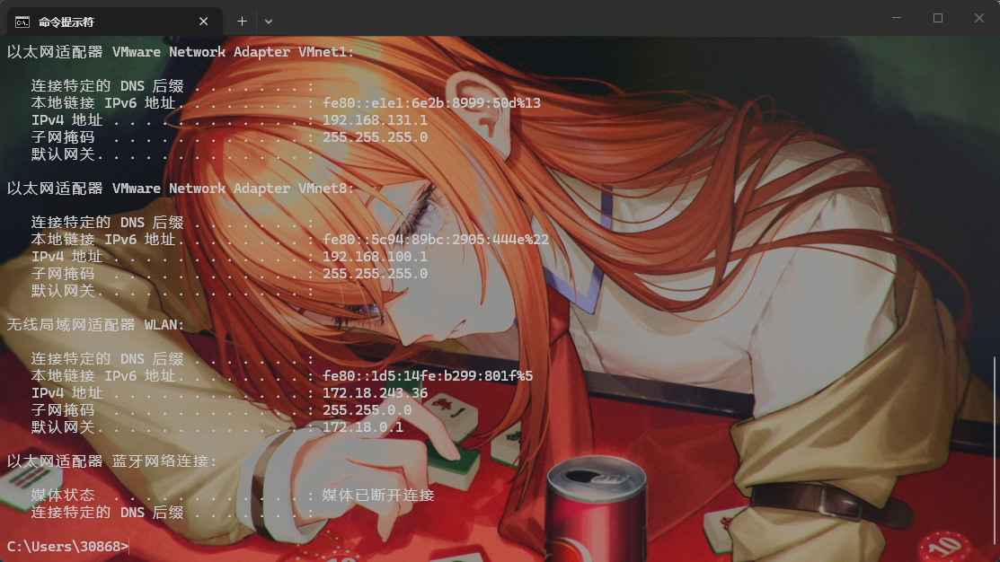
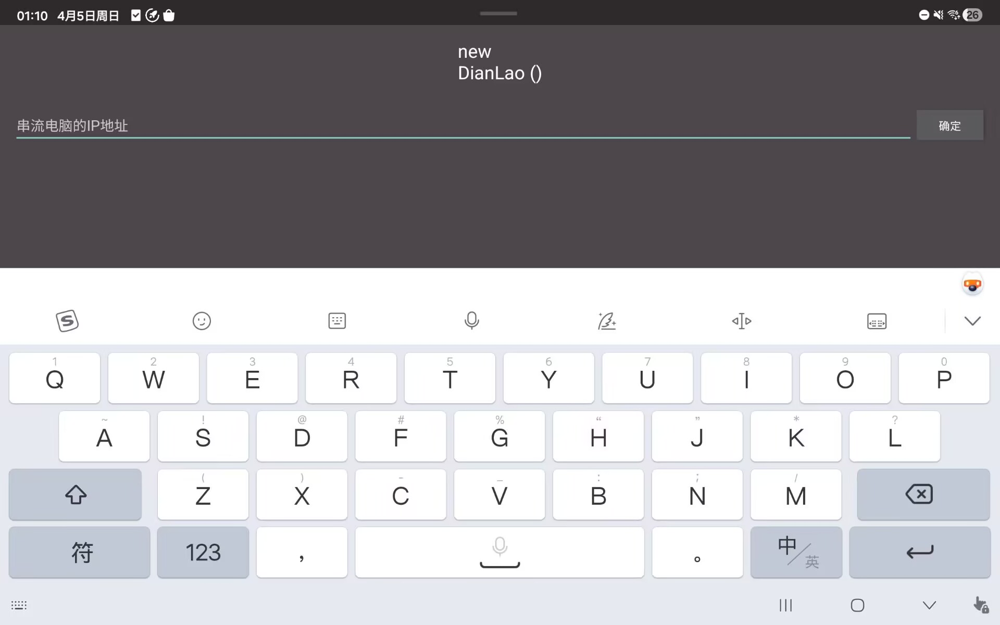
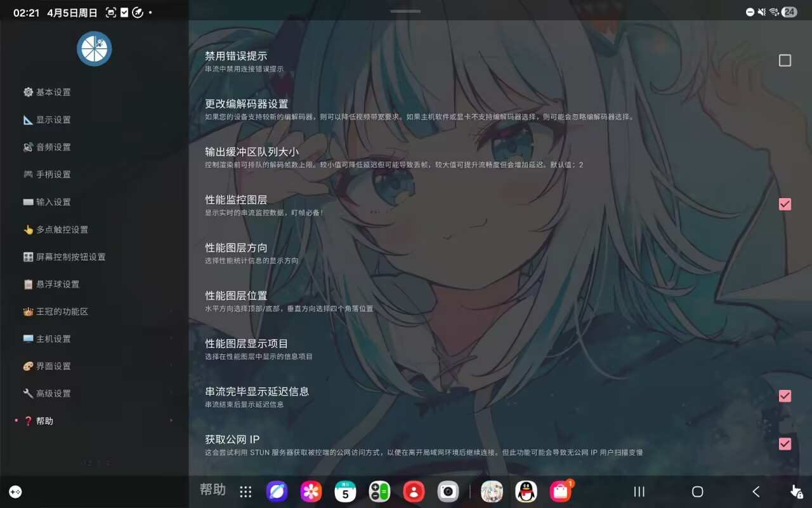
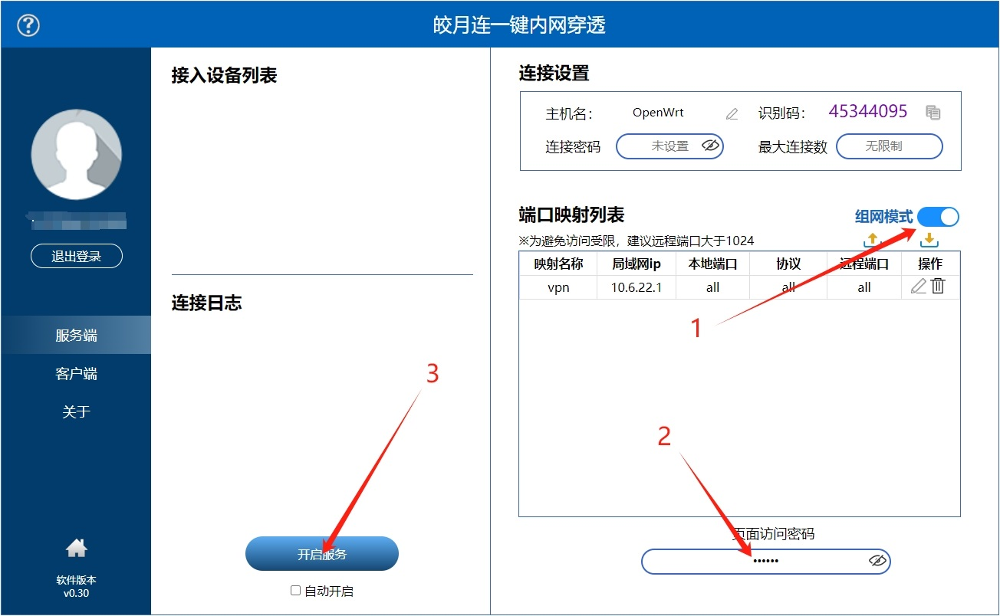
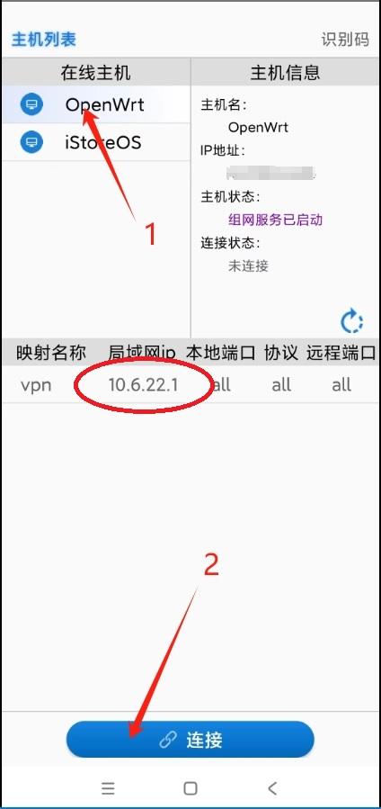
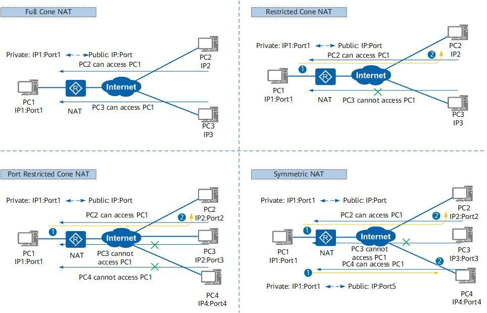
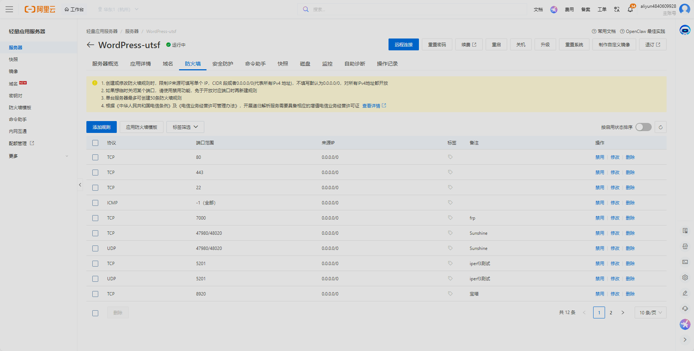
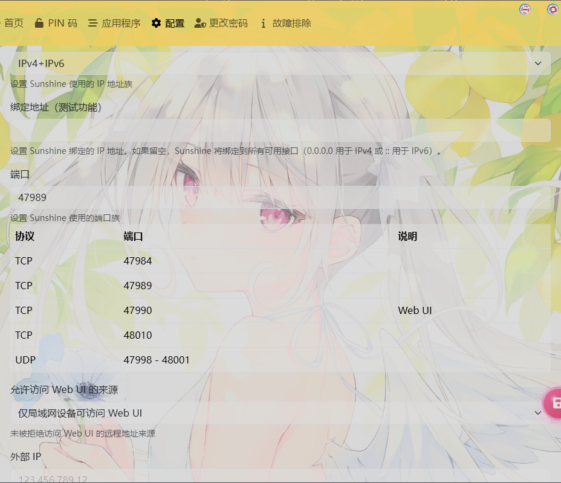

# 校园网串流方案

>🌟**串流核心要点**
 >了解P2P原理和使用异地组网工具搭建内网环境
 >使用ipv6 直连 
 >了解frp中转原理和使用中转服务器实现串流
 >接触了解Sunshine和Moonlight工具

## 🤖串流软件配置

### Sunshine 基地版

Github地址:[Releases · AlkaidLab/foundation-sunshine](https://github.com/AlkaidLab/foundation-sunshine/releases)

#### 安装
安装会给出许多安装组件


	首次安装推荐所有组件都安装，非首次如图勾选

#### 设置
配对（pin）


	如图所示，配对码是后面Moonlight发送过来的


	在应用中可以配置主页，steam，游戏等页面


	在网络设置中将UPnP打开。IP改为IPv4+IPv6;注意下面Sunshine使用的端口，在防火墙中要放行这些端口。


	将所有加密模式设为禁用

### Moonlight v+
Github 地址：[Releases · qiin2333/moonlight-vplus](https://github.com/qiin2333/moonlight-vplus/releases)

在电脑端按win键，搜索cmd，回车，输入ipconfig


	找到自己设备的ipv4地址

在**局域网环境**下，Moonlight中输入设备的ipv4地址，检索到设备。点击向Sunshine发送配对码，配对成功后完成基础设置


#### 设置
在moonlight v+里可以设置串流时的分辨率和帧数，虚拟手柄，虚拟麦克风等等。


	在高级设置里推荐开启性能监控图层，这个HUD非常舒服，能看到网络延迟，帧数，丢包率和编解码速度，帮助你更好地排除问题。
## 🛜IPv6直连方案

如果你的校园网很幸运地有ipv6地址，那么恭喜你，你可以直接通过IPv6直连。
👉 校园网 IPv6 =  
**免费高速公网 + 低延迟 + 可直连服务器**

核心就是：

手机 / 笔记本（Moonlight）  
        ↓（IPv6直连）  
你的电脑（Sunshine）

### 前提条件
### ✅ 1. 两端都有 IPv6

- 校园网 ✔
- 手机：
    - 流量：基本支持
    - WiFi：看运营商

👉 测试：

- 打开 [https://test-ipv6.com/](https://test-ipv6.com/)

### Sunshine 主机配置

记录ipv6地址
例如：

[2408:xxxx:xxxx:xxxx::1234]


	在地址中输入主机的IPV6地址，记得在主机防火墙放行Sunshine对应端口

### 优化
### 🚀 1. 强制走 IPv6（避免走 IPv4）

有时候系统会优先 IPv4

👉 Windows：

Bash
```
netsh interface ipv6 set prefixpolicy ::ffff:0:0/96 10 4
```


👉 或直接：

- 在 Moonlight 只填 IPv6（推荐）

👉 校园网 IPv6：

- 可以直接拉高码率(根据你校园网的带宽，ipv6受到的限制较小)

## 🛜异地组网P2P连接

当我们的两台设备处于不同的网络环境下，moonlight就没法实现串流，怎么解决呢，就是通过内网穿透工具ZeroTier/皎月连打孔，搭建一个虚拟网络，实现两台设备在一个虚拟的局域网内，这样moonlight就可以在同一个虚拟局域网下实现串流了

皎月连下载地址：[皎月连一键内网穿透](https://www.natpierce.cn/pc/downloads/index_new.html)
**服务端：**
 打开软件并登录，在左侧选择“服务端”

         1.开启“组网模式”开关

         2.输入6-20位页面访问密码（这个作用是限制其他组网进来的客户端访问控制页面）

         3.点击左下方“开启服务”按钮，成功后按钮会变成黄色



**客户端**（这里以安卓举例）：

         打开软件并登录

         1.在左上方列表中选择一个在线主机（服务端的主机名）

         2.点击下方“连接”按钮，连接成功后按钮会变成黄色（安卓端第一次使用会询问是否授权，选择“是”）


	
	3.记住映射列表中的局域网ip【10.6.22.1】 按手机home键将软件后台运行

         4.打开应用软件（moonlight），输入虚拟局域网ip【10.6.22.1】建立连接

### 注意

有些校园网的NAT非常严格，UDP打洞几乎必然失败



	校园网结构：

👉 **对称 NAT（Symmetric NAT）**

特点：

- 每个目标地址都会分配不同端口
- 外部无法“反向连接你”

#### 🚫 二、防火墙 / 端口封锁
校园网通常会：
- ❌ 禁 UDP（尤其是高端口）
- ❌ 限制 47984 / 47989（Moonlight常用端口）
- ❌ 限制外网入站连接

👉 就算 NAT 可以，端口被封也会失败

博主本人的校园网环境就属于这种，通过皎月连无法实现异地组网。但还有第三种办法

## 🛜使用云服务器配合 FRP进行内网穿透

使用云服务器配合 FRP（Fast Reverse Proxy）进行内网穿透，是目前校园网环境下**最稳定、成功率最高**的串流方案。

整个过程分为三步：**云服务器端配置（frps）** -> **校园网电脑端配置（frpc）** -> **连接测试**。

### 云服务器配置
首先，你需要准备一台云服务器，如果你是个学生，那么很幸运，你可以通过阿里云学生认证，搞到一台半年的2核2G200Mbps的服务器😁，这种性能拿来搞FRP已经是杀鸡用牛刀了。（系统选Ubuntu 即可）

购买好服务器后，进入防火墙页面，把sunshine所需要的端口全部放行







配置好后，通过**ssh**登上服务器（这一步自找教程）。在服务器上搭载好frp服务
>去 Github 下载对应架构的 frp 压缩包,Github地址：[Releases · fatedier/frp](https://github.com/fatedier/frp/releases)（推荐本地下载好后上传到服务器，云服务器访问github地址经常中断，换镜像站也不好使）
>
>下载完成后，执行解压命令(这里用的是v0.58)：

Bash

```
tar -zxvf frp_0.58.1_linux_amd64.tar.gz
```
>进入解压出来的文件夹：

Bash

```
cd frp_0.58.1_linux_amd64
```
>确认配置文件

进入文件夹后，我们要检查一下服务端配置文件 `frps.toml`。新版 FRP 默认的配置文件已经帮你写好了 `bindPort = 7000`，完全不需要你改代码！

你可以输入下面这个命令看一眼：

Bash

```
cat frps.toml
```

如果屏幕上输出了 `bindPort = 7000`，说明一切完美，直接进入下一步

>试运行服务

现在，我们要让服务端跑起来，测试一下之前阿里云防火墙放行的 `7000` 端口通没通。输入：

Bash

```
./frps -c ./frps.toml
```

**成功的标志：** 如果你按下回车后，屏幕上弹出了几行日志，并且最后一行写着类似 `frps started successfully` 或者 `Run frps successfully`，那么恭喜你！你的云服务器中转站已经成功启动了！

>让 FRP 在后台静默运行

刚才的试运行状态下，如果你把 SSH 连接窗口关掉，FRP 就会跟着断开。为了让它 24 小时待命，我们需要把它挂在后台运行。

先在刚才的黑框里按 `Ctrl + C`，停掉试运行的程序。

然后，复制并执行这行“后台运行”命令：

Bash

```
nohup ./frps -c ./frps.toml > frps.log 2>&1 &
```

执行完后，屏幕可能会跳出一行提示（比如 `[1] 12345`），直接按一下回车键即可。 _(这行命令的意思是：把 frps 放到后台静默运行，哪怕你现在关掉电脑、关掉阿里云页面，它也会一直在服务器里默默工作)_

---

到这里，**云服务器端的所有配置已经 100% 搞定了！**

## 