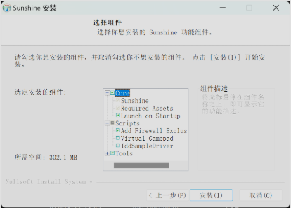
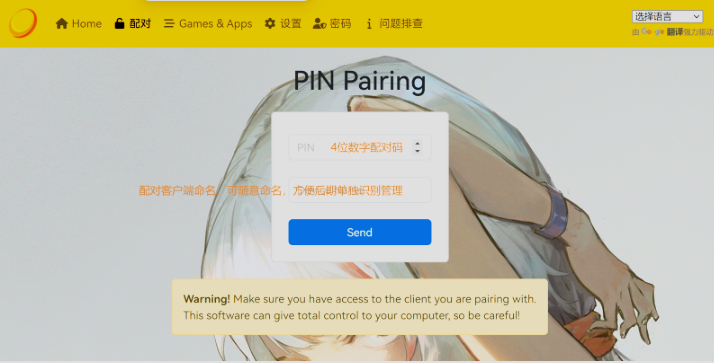
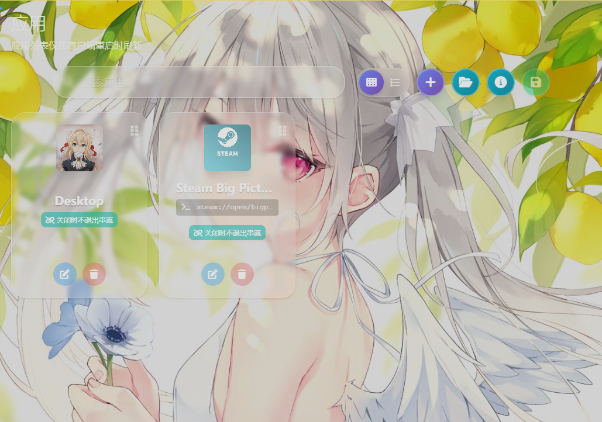
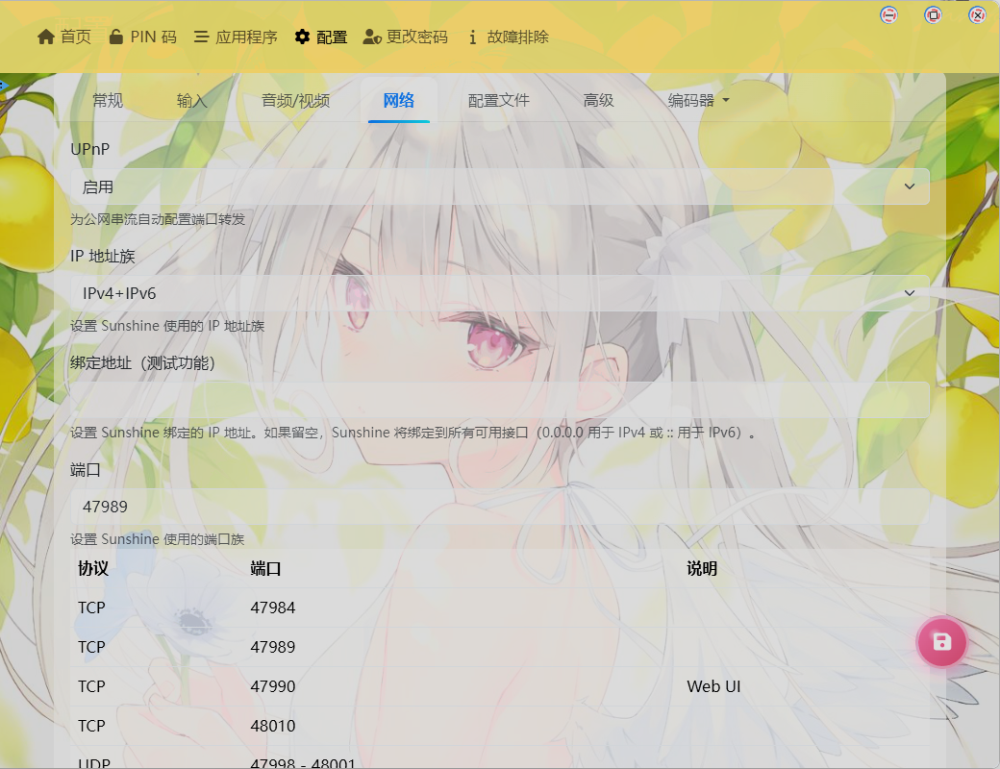
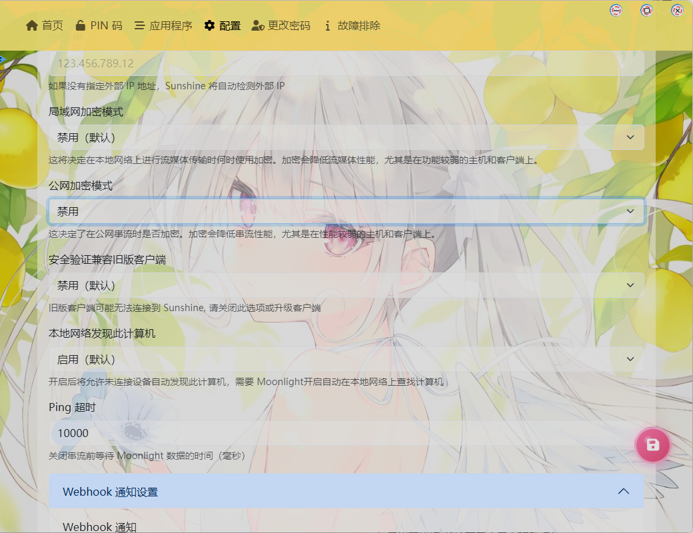
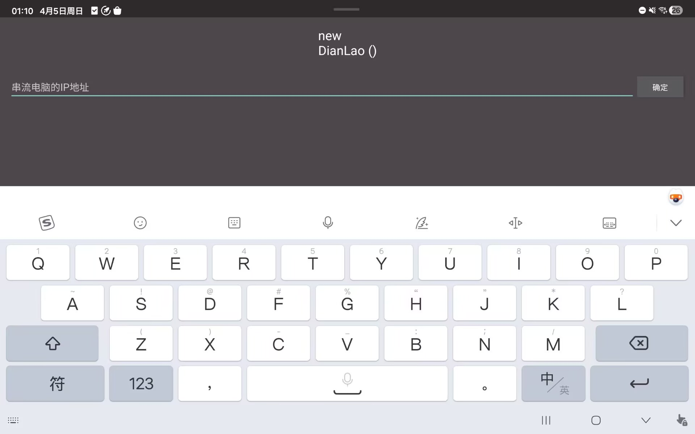

# 校园网串流方案

>🌟**串流核心要点**
 >了解P2P原理和使用异地组网工具搭建内网环境
 >使用ipv6 直连 
 >了解frp中转原理和使用中转服务器实现串流
 >接触了解Sunshine和Moonlight工具

## 🤖串流软件配置

### Sunshine 基地版

Github地址:[Releases · AlkaidLab/foundation-sunshine](https://github.com/AlkaidLab/foundation-sunshine/releases)

#### 安装
安装会给出许多安装组件

	首次安装推荐所有组件都安装，非首次如图勾选

#### 设置
配对（pin）

	如图所示，配对码是后面Moonlight发送过来的

	在应用中可以配置主页，steam，游戏等页面

	在网络设置中将UPnP打开。IP改为IPv4+IPv6;注意下面Sunshine使用的端口，在防火墙中要放行这些端口。

	将所有加密模式设为禁用

## 🛜IPv6直连方案

如果你的校园网很幸运地有ipv6地址，那么恭喜你，你可以直接通过IPv6直连。
👉 校园网 IPv6 =  
**免费高速公网 + 低延迟 + 可直连服务器**

核心就是：

手机 / 笔记本（Moonlight）  
        ↓（IPv6直连）  
你的电脑（Sunshine）

### 前提条件
### ✅ 1. 两端都有 IPv6

- 校园网 ✔
- 手机：
    - 流量：基本支持
    - WiFi：看运营商

👉 测试：

- 打开 [https://test-ipv6.com/](https://test-ipv6.com/)

### Sunshine 主机配置

记录ipv6地址
例如：

[2408:xxxx:xxxx:xxxx::1234]

	在地址中输入主机的IPV6地址，记得在主机防火墙放行Sunshine对应端口

### 优化
### 🚀 1. 强制走 IPv6（避免走 IPv4）

有时候系统会优先 IPv4

👉 Windows：

netsh interface ipv6 set prefixpolicy ::ffff:0:0/96 10 4

👉 或直接：

- 在 Moonlight 只填 IPv6（推荐）

👉 校园网 IPv6：

- 可以直接拉高码率(根据你校园网的带宽，ipv6受到的限制较小)

