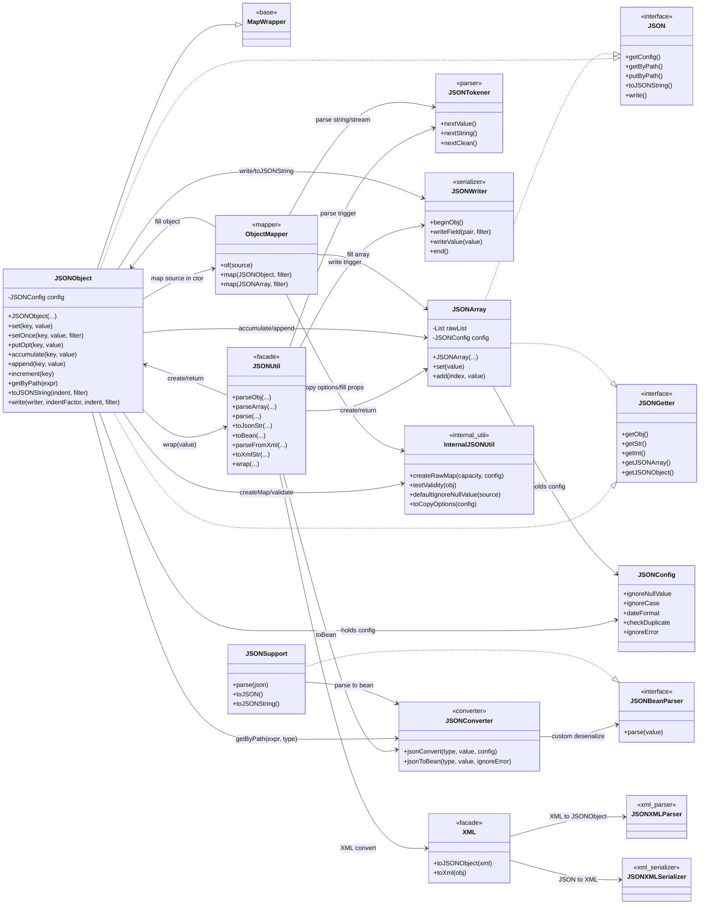

这个文件用于本地测试，不会出现在正式首页列表中。
测试1
测试2
### 测试3
##### 测试4

```mermaid
classDiagram
direction LR

class JSON {
  <<interface>>
  +getConfig()
  +getByPath()
  +putByPath()
  +toJSONString()
  +write()
}

class JSONGetter {
  <<interface>>
  +getObj()
  +getStr()
  +getInt()
  +getJSONArray()
  +getJSONObject()
}

class MapWrapper {
  <<base>>
}

class JSONObject {
  -JSONConfig config
  +JSONObject(...)
  +set(key, value)
  +setOnce(key, value, filter)
  +putOpt(key, value)
  +accumulate(key, value)
  +append(key, value)
  +increment(key)
  +getByPath(expr)
  +toJSONString(indent, filter)
  +write(writer, indentFactor, indent, filter)
}

class JSONArray {
  -List rawList
  -JSONConfig config
  +JSONArray(...)
  +set(value)
  +add(index, value)
}

class JSONConfig {
  +ignoreNullValue
  +ignoreCase
  +dateFormat
  +checkDuplicate
  +ignoreError
}

class JSONUtil {
  <<facade>>
  +parseObj(...)
  +parseArray(...)
  +parse(...)
  +toJsonStr(...)
  +toBean(...)
  +parseFromXml(...)
  +toXmlStr(...)
  +wrap(...)
}

class ObjectMapper {
  <<mapper>>
  +of(source)
  +map(JSONObject, filter)
  +map(JSONArray, filter)
}

class JSONTokener {
  <<parser>>
  +nextValue()
  +nextString()
  +nextClean()
}

class JSONWriter {
  <<serializer>>
  +beginObj()
  +writeField(pair, filter)
  +writeValue(value)
  +end()
}

class JSONConverter {
  <<converter>>
  +jsonConvert(type, value, config)
  +jsonToBean(type, value, ignoreError)
}

class InternalJSONUtil {
  <<internal_util>>
  +createRawMap(capacity, config)
  +testValidity(obj)
  +defaultIgnoreNullValue(source)
  +toCopyOptions(config)
}

class JSONBeanParser {
  <<interface>>
  +parse(value)
}

class JSONSupport {
  +parse(json)
  +toJSON()
  +toJSONString()
}

class XML {
  <<facade>>
  +toJSONObject(xml)
  +toXml(obj)
}

class JSONXMLParser {
  <<xml_parser>>
}

class JSONXMLSerializer {
  <<xml_serializer>>
}

JSONObject --|> MapWrapper
JSONObject ..|> JSON
JSONObject ..|> JSONGetter

JSONArray ..|> JSON
JSONArray ..|> JSONGetter

JSONObject --> JSONConfig : holds config
JSONArray --> JSONConfig : holds config

JSONUtil --> JSONObject : create/return
JSONUtil --> JSONArray : create/return
JSONUtil --> JSONConverter : toBean
JSONUtil --> XML : XML convert
JSONUtil --> JSONTokener : parse trigger
JSONUtil --> JSONWriter : write trigger

JSONObject --> ObjectMapper : map source in ctor
JSONObject --> InternalJSONUtil : createMap/validate
JSONObject --> JSONUtil : wrap(value)
JSONObject --> JSONArray : accumulate/append
JSONObject --> JSONWriter : write/toJSONString
JSONObject --> JSONConverter : getByPath(expr, type)

ObjectMapper --> JSONTokener : parse string/stream
ObjectMapper --> InternalJSONUtil : copy options/fill props
ObjectMapper --> JSONObject : fill object
ObjectMapper --> JSONArray : fill array

JSONConverter --> JSONBeanParser : custom deserialize
JSONSupport ..|> JSONBeanParser
JSONSupport --> JSONConverter : parse to bean

XML --> JSONXMLParser : XML to JSONObject
XML --> JSONXMLSerializer : JSON to XML
```
