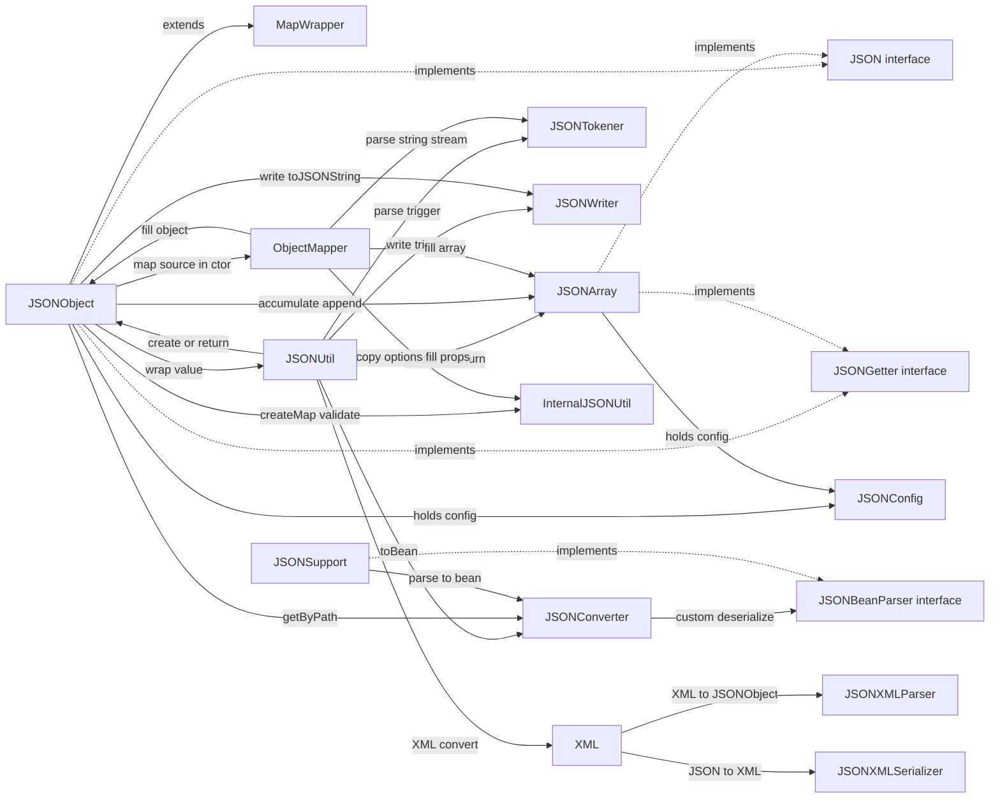
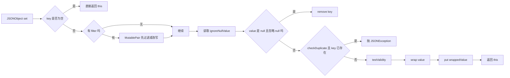

这个文件用于本地测试，不会出现在正式首页列表中。
测试1
测试2
### 测试3
##### 测试4






```mermaid
flowchart LR
A[JSONObject.toString]
--> B[toJSONString(0)]
--> C[toJSONString(indentFactor, filter)]
--> D[StringWriter]
--> E[write(writer, indentFactor, indent, filter)]
--> F[JSONWriter.of(...).beginObj]
--> G[forEach key value]
--> H[jsonWriter.writeField(pair, filter)]
--> I[JSONWriter.writeValueDirect]
--> J{值类型判断}
J -->|JSONObject| K[递归写对象]
J -->|JSONArray| L[递归写数组]
J -->|Date/Temporal| M[按 JSONConfig 格式输出]
J -->|String/Number/Boolean| N[直接写出]
J -->|null| O[按 ignoreNullValue 处理]
K --> P[end]
L --> P
M --> P
N --> P
O --> P
P --> Q[返回 JSON 字符串]

```
