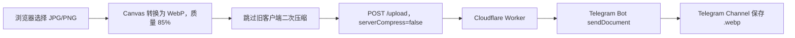

本文说明如何在 CloudFlare-ImgBed 中实现以下流程：用户通过网页选择 JPG、JPEG 或 PNG 图片后，浏览器先把图片转换成 WebP，再将 WebP 上传到 Cloudflare Worker，最后由 Telegram Bot 以原文件形式保存到 Telegram Channel。

> 本教程对应本仓库当前实现。它只处理**网页上传入口**，不会自动转换 PicGo、WebDAV、API 脚本或其他直接调用 `/upload` 的客户端。

## 1. 最终效果

- 只转换 `image/jpeg` 和 `image/png`。
- WebP 编码质量为 `0.85`，即 85%。
- 不改变图片宽高。
- PNG 透明通道保留。
- GIF、SVG、已有 WebP 和非图片文件保持原样。
- WebP 转换失败时回退上传原文件，不中断上传。
- 转换后的 WebP 不再经过旧客户端压缩库二次编码。
- WebP 上传 Telegram 时使用 `sendDocument`，保留 `.webp` 文件名和 `image/webp` MIME。
- HTML 入口由 Worker-first 处理并返回 `no-store`，避免自定义域长期使用旧的前端清单。

正常上传请求应类似：

```text
POST /upload?serverCompress=false&uploadChannel=telegram&...
```

上传成功后，图床文件名和返回链接应以 `.webp` 结尾。

## 2. 整体架构



转换发生在浏览器中，因此不会消耗 Cloudflare Worker 的图片编码 CPU，也不需要在 Worker 中引入 WebAssembly 图片编码器。

## 3. 源码级改造实录

这一节给出具体的源码修改。整体思路不是再搭建一个图片处理服务器，而是直接改造原项目已有的四段链路：

```text
网页上传前处理
→ /upload Worker 接口
→ Telegram Bot API
→ Worker 静态资源发布
```

> 说明：当前后端仓库没有提交完整 Vue 前端源码，只有 `frontend-dist` 和 source map。下面先用 source map 中还原出的 `UploadForm.vue` 代码展示“应该修改什么”，然后给出本仓库实际使用的部署前补丁代码。

### 3.1 前端：只转换 JPG/PNG

**源码语义位置**：前端 `src/components/upload/UploadForm.vue` 的 `beforeUpload(file)` 方法。   
**实际修改文件**：`scripts/patch-webp-upload.mjs`，部署时修改对应的 `frontend-dist/js/923.*.js` bundle。

原上传逻辑只排除了 WebP、GIF 和 SVG，其他图片格式都会尝试转换：

```diff
- const canConvertToWebp = this.convertToWebp
-   && file.type.includes('image')
-   && !file.type.includes('webp')
-   && !file.type.includes('gif')
-   && !file.type.includes('svg');
+ const canConvertToWebp = this.convertToWebp
+   && ['image/jpeg', 'image/png'].includes(file.type);
```

这样 BMP、GIF、SVG、ICO 等格式不会进入该转换分支。

### 3.2 前端：把 WebP 质量从 92% 调整为 85%

**源码语义位置**：前端 `src/components/upload/UploadForm.vue` 的 `convertImageToWebp(file)` 方法。  
**当前仓库实际修改文件**：`scripts/patch-webp-upload.mjs`，替换上传 bundle 中 Canvas `toBlob` 的 WebP 质量参数。

原来的 Canvas 编码参数为 `0.92`：

```diff
  canvas.toBlob(blob => {
    // 将 Blob 包装为 File
- }, 'image/webp', 0.92);
+ }, 'image/webp', 0.85);
```

转换成功后保留原来的宽高，只改变编码格式和文件名：

```js
const originalName = file.name;
const lastDotIndex = originalName.lastIndexOf('.');
const newName = lastDotIndex > 0
  ? `${originalName.substring(0, lastDotIndex)}.webp`
  : `${originalName}.webp`;

const webpFile = new File([blob], newName, {
  type: 'image/webp',
});
webpFile.uid = file.uid;
```

### 3.3 前端：强制初始化 WebP 开关

**源码语义位置**：前端 `src/views/UploadHome.vue` 的 `mounted()` 初始化逻辑。  
**当前仓库实际修改文件**：`scripts/patch-webp-upload.mjs`，替换上传页面 bundle 中 `this.convertToWebp` 的初始化表达式。

原项目会优先读取 Vuex 持久化设置。旧浏览器如果曾保存过 `convertToWebp=false`，即使系统默认值改成 true，也仍然不会转换：

```diff
- this.convertToWebp = this.compressConfig.convertToWebp
-   ?? this.parseBoolean(this.userConfig?.defaultConvertToWebp, false);
+ this.convertToWebp = true;
```

这样页面每次初始化时都会启用 JPG/PNG 转 WebP。

### 3.4 前端：阻止 WebP 二次压缩

**源码语义位置**：前端 `src/components/upload/UploadForm.vue` 的 `beforeUpload(file)` 方法，在 `needCustomCompress` 判断处。  
**当前仓库实际修改文件**：`scripts/patch-webp-upload.mjs`，修改 bundle 中 `customerCompress` 的条件表达式。

原项目在 WebP 转换之后，还会执行 `imageConversion.compressAccurately`：

```js
const needCustomCompress = processedFile.type.includes('image')
  && this.customerCompress
  && processedFile.size / 1024 / 1024 > this.compressBar;
```

但当前 `image-conversion` 版本只正确支持 PNG、JPEG 和 GIF 输出。把 WebP 再交给它，可能重新编码成 JPEG/PNG，或者造成文件名与 MIME 不一致。

修改为：本次进入 WebP 转换分支时，不再执行旧客户端压缩。

```diff
- const needCustomCompress = processedFile.type.includes('image')
+ const needCustomCompress = !canConvertToWebp
+   && processedFile.type.includes('image')
    && this.customerCompress
    && processedFile.size / 1024 / 1024 > this.compressBar;
```

85% WebP 编码本身已经完成压缩，不需要再编码一次。

### 3.5 前端：WebP 关闭 Telegram 服务端压缩

**源码语义位置**：前端 `src/components/upload/UploadForm.vue` 的 `beforeUpload(file)` 方法，在 `pushFileToQueue()` 写入 `fileList` 时。  
**当前仓库实际修改文件**：`scripts/patch-webp-upload.mjs`，修改 bundle 中 `serverCompress` 字段。

上传队列原本直接保存计算出的 `serverCompress`：

```diff
  this.fileList.push({
    uid: file.uid,
    name: file.name,
-   serverCompress,
+   serverCompress: canConvertToWebp ? false : serverCompress,
    retryCount: 0,
  });
```

最终 WebP 请求会变成：

```text
POST /upload?serverCompress=false&uploadChannel=telegram&...
```

如果 Network 中仍看到 `serverCompress=true`，说明当前页面没有执行到新 WebP 分支，通常是自定义域仍访问旧 Worker。

### 3.6 实际落地：部署前修改编译 bundle

**新增文件**：`scripts/patch-webp-upload.mjs`。  
**读取目录**：`frontend-dist/js`。  
**运行时修改**：当前版本的上传 chunk `frontend-dist/js/923.*.js` 及对应 `.js.gz`；上游更新后 chunk 哈希可能变化，因此脚本通过内容锚点查找，不依赖固定文件名。

由于当前仓库只有编译后的前端，本方案新增一个 Node.js 补丁脚本。脚本在 `frontend-dist/js` 中寻找上传 bundle，并修改以下锚点：

```js
const ORIGINAL_CONDITION = /this\.convertToWebp&&([A-Za-z_$][\w$]*)\.type\.includes\("image"\)&&!\1\.type\.includes\("webp"\)&&!\1\.type\.includes\("gif"\)&&!\1\.type\.includes\("svg"\)/g;

const PATCHED_CONDITION = /this\.convertToWebp&&\["image\/jpeg","image\/png"\]\.includes\(([A-Za-z_$][\w$]*)\.type\)/g;

const ORIGINAL_QUALITY = /"image\/webp",\.92/g;
const PATCHED_QUALITY = /"image\/webp",\.85/g;

const ORIGINAL_CLIENT_COMPRESSION = /const i=a\.type\.includes\("image"\)&&this\.customerCompress&&a\.size\/1024\/1024>this\.compressBar/g;
const PATCHED_CLIENT_COMPRESSION = /const i=!s&&a\.type\.includes\("image"\)&&this\.customerCompress&&a\.size\/1024\/1024>this\.compressBar/g;

const ORIGINAL_SERVER_COMPRESSION = /serverCompress:o,retryCount:0/g;
const PATCHED_SERVER_COMPRESSION = /serverCompress:o&&!s,retryCount:0/g;
```

核心替换代码如下：

```js
if (originalConditionCount === 1) {
  patched = patched.replace(
    ORIGINAL_CONDITION,
    (original, fileVariable) => {
      const replacement =
        `this.convertToWebp&&["image/jpeg","image/png"].includes(${fileVariable}.type)`;

      // 保持长度，尽量避免破坏原 source map 的后续列位置。
      return replacement.padEnd(original.length, ' ');
    },
  );
}

if (originalQualityCount === 1) {
  patched = patched.replace(
    ORIGINAL_QUALITY,
    '"image/webp",.85',
  );
}

if (originalClientCompressionCount === 1) {
  patched = patched.replace(
    ORIGINAL_CLIENT_COMPRESSION,
    'const i=!s&&a.type.includes("image")&&this.customerCompress&&a.size/1024/1024>this.compressBar',
  );
}

if (originalServerCompressionCount === 1) {
  patched = patched.replace(
    ORIGINAL_SERVER_COMPRESSION,
    'serverCompress:o&&!s,retryCount:0',
  );
}
```

补丁写入 JavaScript 后，同步重新生成 `.gz`：

```js
writeFileSync(candidate.jsPath, candidate.content);
writeFileSync(
  `${candidate.jsPath}.gz`,
  gzipSync(Buffer.from(candidate.content)),
);
```

脚本还会验证每个原始或已修改锚点只出现一次。如果匹配不到，直接抛出错误：

```js
throw new Error(
  'No compatible WebP upload bundle was found; the upstream frontend may have changed.',
);
```

这可以避免上游更新前端后，GitHub Actions 看似部署成功，但 WebP 功能已经静默失效。

### 3.7 增加 npm 命令

**修改文件**：`package.json`。  
**修改位置**：顶层 `scripts` 对象。

在 `package.json` 的 `scripts` 中增加：

```diff
  {
    "scripts": {
+     "patch:webp": "node scripts/patch-webp-upload.mjs frontend-dist"
    }
  }
```

本地可以执行：

```bash
npm run patch:webp
```

### 3.8 修改 GitHub Actions 顺序

**修改文件**：`.github/workflows/deploy-worker.yml`。  
**新增位置**：`jobs.deploy.steps` 中，位于 `Install dependencies` 和 `Generate worker routes` 之间。

在 Worker 部署工作流中，把 WebP 补丁放在 Wrangler 收集静态资源之前：

```yaml
- name: Install dependencies
  if: steps.check.outputs.skip != 'true'
  run: npm ci --omit=dev --omit=optional

- name: Apply WebP upload customization
  if: steps.check.outputs.skip != 'true'
  run: npm run patch:webp

- name: Generate worker routes
  if: steps.check.outputs.skip != 'true'
  run: node deploy/worker/generate-routes.js

- name: Generate wrangler config
  if: steps.check.outputs.skip != 'true'
  run: node deploy/worker/generate-toml.js

- name: Deploy to Cloudflare Workers
  if: steps.check.outputs.skip != 'true'
  uses: cloudflare/wrangler-action@v3
  with:
    apiToken: ${{ secrets.CLOUDFLARE_API_TOKEN }}
    accountId: ${{ secrets.CLOUDFLARE_ACCOUNT_ID }}
    wranglerVersion: '4'
    command: deploy --config deploy/worker/wrangler.toml
```

最终顺序是：

```text
安装依赖
→ 修改前端 bundle
→ 生成 Worker 路由
→ 生成 Wrangler 配置
→ 部署代码与静态资源
```

### 3.9 后端：删除 WebP 改名为 JPEG 的逻辑

**删除位置**：`functions/upload/index.js`。  
**所属函数**：`uploadFileToTelegram(context, fullId, metadata, fileExt, fileName, fileType, returnLink)`。  

原 Telegram 上传代码为了规避 animation 行为，会把 WebP 文件名改成 `.jpeg`：

```diff
  if (fileExt === 'gif') {
    const newFileName = fileName.replace(/\.gif$/, '.jpeg');
    const newFile = new File([formdata.get('file')], newFileName, {
      type: fileType,
    });
    formdata.set('file', newFile);
- } else if (fileExt === 'webp') {
-   const newFileName = fileName.replace(/\.webp$/, '.jpeg');
-   const newFile = new File([formdata.get('file')], newFileName, {
-     type: fileType,
-   });
-   formdata.set('file', newFile);
  }
```

修改后只保留 GIF 兼容处理，WebP 文件名保持 `photo.webp`。

实际代码把文件名规则抽成函数：

```js
export function getTelegramStoredFileName(fileName, fileExt) {
  if ((fileExt || '').toLowerCase() === 'gif') {
    return fileName.replace(/\.gif$/i, '.jpeg');
  }
  return fileName;
}
```

上传前应用该规则：

```js
const telegramFileName = getTelegramStoredFileName(
  fileName,
  fileExt,
);

if (telegramFileName !== fileName) {
  const renamedFile = new File(
    [formdata.get('file')],
    telegramFileName,
    { type: fileType },
  );
  formdata.set('file', renamedFile);
}
```

对于 WebP，函数直接返回原文件名，因此不会发生重命名。

### 3.10 后端：WebP 改用 sendDocument

**删除位置**：`functions/upload/index.js` 的 `uploadFileToTelegram()`，原 `fileTypeMap` 和 GIF/WebP 特殊接口判断区域。  
**新增文件**：`functions/upload/telegramUploadPolicy.js`，新增 `selectTelegramSendFunction()`。  
**调用位置**：`functions/upload/index.js` 的 `uploadFileToTelegram()`，在调用 `telegramAPI.sendFile()` 之前。

原策略把 WebP 发送为 animation：

```diff
- if (
-   fileType === 'image/gif'
-   || fileType === 'image/webp'
-   || fileExt === 'gif'
-   || fileExt === 'webp'
- ) {
-   sendFunction = {
-     url: 'sendAnimation',
-     type: 'animation',
-   };
- }
```

改造后的策略如下：

```js
const DOCUMENT = {
  url: 'sendDocument',
  type: 'document',
};

export function selectTelegramSendFunction(
  fileType = '',
  fileExt = '',
  serverCompress = true,
) {
  const normalizedType = fileType.toLowerCase();
  const normalizedExt = fileExt.toLowerCase();

  // WebP 永远作为原始 document 保存。
  if (
    !serverCompress
    || normalizedType === 'image/webp'
    || normalizedExt === 'webp'
  ) {
    return { ...DOCUMENT };
  }

  if (
    normalizedType === 'image/gif'
    || normalizedExt === 'gif'
  ) {
    return {
      url: 'sendAnimation',
      type: 'animation',
    };
  }

  if (normalizedType.startsWith('image/')) {
    return {
      url: 'sendPhoto',
      type: 'photo',
    };
  }

  return { ...DOCUMENT };
}
```

Worker 上传区域调用：

```js
const serverCompress =
  url.searchParams.get('serverCompress') !== 'false';

const sendFunction = selectTelegramSendFunction(
  fileType,
  fileExt,
  serverCompress,
);

const response = await telegramAPI.sendFile(
  formdata.get('file'),
  tgChatId,
  sendFunction.url,
  sendFunction.type,
);
```

### 3.11 Telegram API：关闭内容类型自动识别

**修改文件**：`functions/utils/storage/telegramAPI.js`。  
**所属方法**：`TelegramAPI.sendFile(file, chatId, functionName, functionType, caption, fileName)`。  
**新增位置**：构造完 `FormData`、调用 `fetch()` 之前。

构造 Telegram multipart 请求时，为 `sendDocument` 增加：

```js
if (functionName === 'sendDocument') {
  formData.append(
    'disable_content_type_detection',
    'true',
  );
}
```

完整关键部分：

```js
const formData = new FormData();
formData.append('chat_id', chatId);
formData.append(functionType, file);

if (caption) {
  formData.append('caption', caption);
}

if (functionName === 'sendDocument') {
  formData.append(
    'disable_content_type_detection',
    'true',
  );
}

const response = await fetch(
  `${this.baseURL}/${functionName}`,
  {
    method: 'POST',
    headers: this.defaultHeaders,
    body: formData,
  },
);
```

这保证 Telegram 收到：

```text
字段名：document
文件名：photo.webp
MIME：image/webp
disable_content_type_detection：true
```

### 3.12 Telegram API：返回真实错误

**修改文件一**：`functions/utils/storage/telegramAPI.js` 的 `TelegramAPI.sendFile()`，删除只使用 `response.statusText` 的错误处理，改为解析 JSON `description`。  
**修改文件二**：`functions/upload/index.js` 的 `uploadFileToTelegram()` catch 分支，删除固定通用错误，改为调用格式化函数。  
**新增位置**：`functions/upload/telegramUploadPolicy.js` 中增加 `formatTelegramUploadError()`。

原代码只使用 HTTP `statusText`：

```diff
- if (!response.ok) {
-   throw new Error(
-     `Telegram API error: ${response.statusText}`,
-   );
- }
```

修改后先解析 JSON，再读取 Bot API 的 `description`：

```js
let responseData = null;

try {
  responseData = await response.json();
} catch (error) {
  if (response.ok) {
    throw new Error(
      `Telegram API returned invalid JSON: ${error.message}`,
    );
  }
}

if (!response.ok || responseData?.ok === false) {
  const description = responseData?.description
    || response.statusText
    || `HTTP ${response.status}`;

  throw new Error(
    `Telegram API error: ${description}`,
  );
}
```

上传入口不再把异常替换成固定字符串，而是保留真实错误：

```diff
  } catch (error) {
-   res = createResponse(
-     'upload error, check your environment params about telegram channel!',
-     { status: 400 },
-   );
+   res = createResponse(
+     `upload error: ${error.message}`,
+     { status: 502 },
+   );
  }
```

### 3.13 Worker 静态资源：启用 Worker-first

**修改文件一**：`deploy/worker/wrangler.toml` 的 `[assets]` 段。  
**修改文件二**：`deploy/worker/generate-toml.js` 中生成 `[assets]` 的模板字符串。  
必须同时修改两处，因为 GitHub Actions 部署时会重新生成 `wrangler.toml`。

在 Wrangler 的 `[assets]` 中增加：

```toml
[assets]
directory = "../../frontend-dist"
binding = "ASSETS"
not_found_handling = "single-page-application"
run_worker_first = true
```

因为 GitHub Actions 会动态生成 `wrangler.toml`，不仅要改本地 TOML，还要在生成脚本模板中加入同一行：

```js
let toml = `
[assets]
directory = "../../frontend-dist"
binding = "ASSETS"
not_found_handling = "single-page-application"
run_worker_first = true
`;
```

### 3.14 Worker 静态资源：HTML 不缓存

**修改源文件**：`deploy/worker/generate-routes.js` 的 Worker 输出模板。  
**新增函数**：`fetchWorkerAsset(request, env)`。  
**替换位置**：生成模板中 `if (!matched)` 的 `env.ASSETS.fetch(request)` 回退。  
**生成文件**：运行脚本后同步更新 `deploy/worker/index.js`；该文件是生成结果，不应只手工修改它。

在 Worker 的静态资源回退处新增：

```js
async function fetchWorkerAsset(request, env) {
  const response = await env.ASSETS.fetch(request);
  const contentType =
    response.headers.get('Content-Type') || '';

  // JS/CSS/图片等带哈希资源继续正常缓存。
  if (!contentType.toLowerCase().includes('text/html')) {
    return response;
  }

  const headers = new Headers(response.headers);
  headers.set(
    'Cache-Control',
    'no-store, no-cache, must-revalidate',
  );
  headers.set('CDN-Cache-Control', 'no-store');
  headers.set(
    'Cloudflare-CDN-Cache-Control',
    'no-store',
  );
  headers.set(
    'X-ImgBed-Asset-Policy',
    'worker-first-no-store',
  );
  headers.delete('ETag');

  return new Response(response.body, {
    status: response.status,
    statusText: response.statusText,
    headers,
  });
}
```

原来的资产回退：

```diff
  if (!matched) {
    if (env.ASSETS) {
-     return env.ASSETS.fetch(request);
+     return fetchWorkerAsset(request, env);
    }
    return new Response('Not Found', {
      status: 404,
    });
  }
```

这样 HTML 每次从当前部署的 `ASSETS` binding 获取，而带哈希的静态资源仍保留缓存性能。

### 3.15 Cloudflare 控制台：删除旧 Workers Route

**非仓库文件修改**：Cloudflare Dashboard → 域名 → Workers 路由。  
**删除对象**：仍指向旧 Worker 的 `tu.example.com/*` Route。  
不要删除旧 Worker 服务本身，只删除它对当前图床域名的路由占用。

代码部署成功后，还必须检查 Cloudflare 的“Workers 路由”。如果存在：

```text
tu.example.com/* → old-image-worker
```

即使新 Worker 已配置 Custom Domain，该旧 Route 仍可能接管请求。删除旧 Route，只保留：

```text
tu.example.com → cloudflare-imgbed
```

这是本次实际排查中导致自定义域一直加载旧前端的根因。它不是代码 Bug，而是旧路由仍指向旧 Worker。

### 3.16 对应的回归测试

**新增或修改的测试文件**：

- `test/webp-upload-patcher.test.js`：前端 bundle 补丁、85% 质量、二次压缩和 `serverCompress`。
- `test/telegram-upload-policy.test.js`：WebP 文件名和 Telegram 发送策略。
- `test/telegram-api.test.js`：`sendDocument` 参数及真实错误描述。
- `test/worker-asset-cache.test.js`：Worker-first 和 HTML no-store。

至少应覆盖以下断言：

```js
assert.ok(
  patched.includes(
    '["image/jpeg","image/png"].includes(',
  ),
);
assert.ok(patched.includes('"image/webp",.85'));
assert.ok(
  patched.includes(
    'serverCompress:o&&!s,retryCount:0',
  ),
);
```

Telegram 策略测试：

```js
assert.equal(
  getTelegramStoredFileName('photo.webp', 'webp'),
  'photo.webp',
);

assert.deepEqual(
  selectTelegramSendFunction(
    'image/webp',
    'webp',
    true,
  ),
  {
    url: 'sendDocument',
    type: 'document',
  },
);
```

Worker 静态资源测试：

```js
assert.match(
  wranglerConfig,
  /run_worker_first\s*=\s*true/,
);

assert.match(
  generatedWorker,
  /worker-first-no-store/,
);
```

完整测试命令：

```bash
npm test
```

### 3.17 增删改文件汇总

| 文件或配置 | 操作 | 具体位置与作用 |
| --- | --- | --- |
| `scripts/patch-webp-upload.mjs` | 新增 | 查找并修改 `frontend-dist/js` 上传 bundle，设置 JPG/PNG → WebP、质量 85%、跳过二次压缩、关闭 `serverCompress`，并重建 `.gz` |
| `package.json` | 修改 | 在 `scripts` 中增加 `patch:webp` 命令 |
| `.github/workflows/deploy-worker.yml` | 修改 | 在 Wrangler 构建前增加 `Apply WebP upload customization` 步骤 |
| `functions/upload/index.js` | 删除、修改 | 在 `uploadFileToTelegram()` 中删除 WebP 改名 `.jpeg` 和 `sendAnimation` 处理；调用新策略并透传错误 |
| `functions/upload/telegramUploadPolicy.js` | 新增 | 集中处理 Telegram 文件名、`sendDocument` 策略和错误格式化 |
| `functions/utils/storage/telegramAPI.js` | 修改 | 在 `sendFile()` 中增加 `disable_content_type_detection`，解析 Telegram JSON 错误描述 |
| `deploy/worker/wrangler.toml` | 修改 | 在 `[assets]` 中增加 `run_worker_first = true` |
| `deploy/worker/generate-toml.js` | 修改 | 让 GitHub Actions 生成的 Wrangler 配置也包含 Worker-first |
| `deploy/worker/generate-routes.js` | 修改 | 在生成模板中增加 `fetchWorkerAsset()` 和 HTML no-store 响应头 |
| `deploy/worker/index.js` | 生成更新 | 由 `generate-routes.js` 重新生成，包含 Worker-first 的资产回退逻辑 |
| `test/webp-upload-patcher.test.js` | 修改 | 验证前端补丁和失败保护 |
| `test/telegram-upload-policy.test.js` | 新增 | 验证 WebP 文件名、document 策略和错误格式 |
| `test/telegram-api.test.js` | 新增 | 验证 Telegram multipart 和错误描述 |
| `test/worker-asset-cache.test.js` | 新增 | 验证 Worker-first 和 HTML no-store |
| Cloudflare Workers Route | 删除控制台配置 | 删除 `tu.example.com/* → old-image-worker`，防止旧 Worker 抢先接管自定义域 |

## 4. 前端 WebP 转换策略

`npm run patch:webp` 最终让上传逻辑遵循以下条件：

```text
文件 MIME 是 image/jpeg 或 image/png
并且 WebP 转换已启用
```

转换参数：

```text
输出 MIME：image/webp
质量：0.85
尺寸：保持原图尺寸
```

转换完成后会生成新的浏览器 `File`：

```text
原文件：photo.png，image/png
新文件：photo.webp，image/webp
```

### 4.1 为什么必须跳过二次客户端压缩

项目原有的 `image-conversion` 版本只正确支持 PNG、JPEG 和 GIF 输出，不支持 WebP 输出。如果先转换 WebP，再把 WebP 交给该库，可能发生：

- 再次解码和编码，导致上传前处理明显变慢；
- 输出变回 JPEG/PNG；
- 文件扩展名和真实二进制 MIME 不一致。

因此 WebP 转换成功后必须绕过旧客户端压缩逻辑。85% WebP 编码本身已经完成了有损压缩，不需要再压缩一次。

## 5. Telegram 保存策略

### 5.1 使用 sendDocument

Telegram Bot API 对图片提供 `sendPhoto`、`sendAnimation` 和 `sendDocument` 等接口。要保留 WebP 原始内容，必须使用：

```text
sendDocument
```

不能使用 `sendPhoto`，否则 Telegram 可能重新压缩图片；也不应把静态 WebP 当作 animation。

### 5.2 保留文件名和 MIME

上传到 Telegram 的 multipart 字段应保持：

```text
filename="photo.webp"
Content-Type: image/webp
```

同时为 `sendDocument` 添加：

```text
disable_content_type_detection=true
```

这可以避免 Telegram 根据文件内容自动改变 document 类型。

### 5.3 Telegram 错误透传

Telegram API 失败时，后端会读取响应 JSON 中的 `description`。前端最终可以看到类似：

```text
upload error: Telegram API error: Bad Request: ...
```

而不是没有诊断价值的通用错误：

```text
upload error, check your environment params about telegram channel!
```

## 6. GitHub Actions 部署流程

`.github/workflows/deploy-worker.yml` 的核心顺序是：

```text
Checkout
→ npm ci --omit=dev --omit=optional
→ npm run patch:webp
→ node deploy/worker/generate-routes.js
→ node deploy/worker/generate-toml.js
→ wrangler deploy
```

其中 WebP 补丁必须发生在 Wrangler 收集 `frontend-dist` 静态资源之前。

### 6.1 必需的 GitHub Secrets

进入：

```text
GitHub 仓库
→ Settings
→ Secrets and variables
→ Actions
```

至少配置：

| Secret | 说明 |
| --- | --- |
| `CLOUDFLARE_API_TOKEN` | 具有 Worker 部署权限的 API Token |
| `CLOUDFLARE_ACCOUNT_ID` | Worker 所在 Cloudflare 账号 ID |
| `KV_NAMESPACE_ID` 或 `D1_DATABASE_ID` | 图床数据库绑定，按实际部署方式选择 |

可选：

| Secret | 说明 |
| --- | --- |
| `WORKER_NAME` | Worker 名称；为空时默认 `cloudflare-imgbed` |
| `R2_BUCKET_NAME` | 使用 R2 时填写 |
| `WORKER_VARS` | JSON 格式的业务环境变量 |

不要把 Bot Token、API Token 或其他密钥直接写进仓库文件。

### 6.2 手动部署

GitHub 仓库的 Actions 页面选择：

```text
Deploy to Cloudflare Workers
→ Run workflow
→ Branch: main
```

如需覆盖 Worker 名称，可在 `worker_name` 中填写实际服务名称。

## 7. Cloudflare 自定义域名配置

GitHub Actions 只负责把代码部署到 Worker，不会根据 Account ID 自动推断域名应该绑定哪个服务。域名绑定需要在 Cloudflare 中单独完成一次。

例如：

```text
Worker：cloudflare-imgbed
Worker URL：cloudflare-imgbed.<account-subdomain>.workers.dev
自定义域名：tu.example.com
```

进入：

```text
Cloudflare Dashboard
→ Workers 和 Pages
→ cloudflare-imgbed
→ 域
→ 添加域名
```

添加：

```text
tu.example.com
```

添加成功后，DNS 记录中应显示该子域名的类型为 Worker，目标为 `cloudflare-imgbed`。

### 7.1 删除旧 CNAME

如果添加域名时报错：

```text
Hostname already has externally managed DNS records
```

说明该子域名已经存在 A 或 CNAME。例如：

```text
tu.example.com CNAME example.com
```

需要先删除这条旧记录，再通过 Worker 的“添加域名”功能创建 Custom Domain。删除子域名记录不会删除根域名网站。

### 7.2 必须检查旧 Workers Route

Custom Domain 配置正确后，还要检查：

```text
Cloudflare → 域名 → Workers 路由
```

旧部署可能存在：

```text
tu.example.com/* → old-image-worker
```

该 Route 会抢先接管请求，使 Custom Domain 虽然显示绑定新 Worker，实际仍访问旧 Worker。推荐删除旧路由，只保留：

```text
tu.example.com → cloudflare-imgbed Custom Domain
```

本项目排查时的实际根因就是一条旧路由仍指向旧图床 Worker。

## 8. Worker Static Assets 缓存处理

Wrangler 资产配置启用了：

```toml
[assets]
directory = "../../frontend-dist"
binding = "ASSETS"
not_found_handling = "single-page-application"
run_worker_first = true
```

`run_worker_first = true` 确保 HTML 请求先进入当前部署的 Worker，再读取当前 `ASSETS` binding。

HTML 响应会带上：

```text
Cache-Control: no-store, no-cache, must-revalidate
CDN-Cache-Control: no-store
Cloudflare-CDN-Cache-Control: no-store
X-ImgBed-Asset-Policy: worker-first-no-store
```

带哈希的 JS、CSS、字体和图片仍可缓存，以保持访问性能。

> 不建议长期为整个图床域名创建“绕过所有缓存”的 Cache Rule。确认旧 Worker Route 已删除且 Worker-first 生效后，可以删除临时缓存绕过规则。

## 9. 本地测试

安装依赖：

```bash
npm ci
```

运行全部测试：

```bash
npm test
```

当前测试覆盖：

- 只转换 JPG/PNG；
- WebP 质量为 85%；
- 跳过二次客户端压缩；
- WebP 禁用 Telegram 服务端压缩；
- 补丁幂等性；
- 不兼容前端 bundle 时阻止部署；
- Telegram WebP 文件名和 sendDocument 策略；
- Telegram API 错误描述；
- Worker-first 和 HTML no-store 策略。

单独验证部署前补丁：

```bash
npm run patch:webp
```

注意：该命令会直接修改本地 `frontend-dist` 构建产物。GitHub Actions 中执行时，只修改临时 checkout，不会把生成结果自动提交回仓库。

## 10. 上线验证

### 10.1 先验证 workers.dev

先访问 Worker 原始地址：

```text
https://cloudflare-imgbed.<account-subdomain>.workers.dev
```

开发者工具 Network 中，HTML Document 响应应包含：

```text
X-ImgBed-Asset-Policy: worker-first-no-store
```

### 10.2 再验证自定义域名

访问：

```text
https://tu.example.com
```

它必须加载与 workers.dev 相同的前端资源。若两个域名加载的 `app.*.js` 哈希不同，通常不是浏览器缓存问题，而是：

- 旧 Workers Route 仍指向旧服务；
- 自定义域名绑定到了错误 Worker；
- DNS 仍是旧 CNAME；
- 请求被其他重定向、源站或配置规则接管。

### 10.3 验证上传请求

上传新的 JPG/PNG，在 Network 中检查 `/upload`：

```text
serverCompress=false
uploadChannel=telegram
```

如果仍是：

```text
serverCompress=true
```

说明当前页面没有执行 WebP 转换。优先检查浏览器加载的上传 bundle 是否为新版本，以及自定义域是否仍指向旧 Worker。

### 10.4 验证最终文件

确认以下项目：

- 返回 URL 以 `.webp` 结尾；
- 管理面板显示 `image/webp`；
- Telegram 消息类型为 Document；
- Telegram 文件名以 `.webp` 结尾；
- 下载后的文件可被 WebP 解码器正常识别。

## 11. 常见问题

### Q1：为什么上传解析变慢，但文件还是 PNG？

常见原因是 WebP 转换开关被浏览器持久化配置覆盖，或者转换后又进入旧客户端压缩库。本方案强制初始化 WebP，并阻止转换后的文件二次压缩。

### Q2：为什么请求一直是 `serverCompress=true`？

说明该文件没有进入成功的 WebP 分支，或者页面仍是旧前端。检查：

1. 原文件 MIME 是否为 `image/jpeg` 或 `image/png`；
2. 自定义域和 workers.dev 是否加载同一版前端；
3. 是否存在旧 Workers Route；
4. 上传 bundle 中是否包含 85% WebP 补丁。

### Q3：为什么 `cf-cache-status` 仍显示 HIT？

带哈希的 JS、CSS 和图片命中 Workers Static Assets 缓存是正常现象。判断 HTML 是否经过新 Worker，应检查 Document 响应中的：

```text
X-ImgBed-Asset-Policy: worker-first-no-store
```

不要只查看旧 `app.<hash>.js` 的响应头。

### Q4：为什么 Telegram 上传失败后所有备用渠道也报错？

项目开启自动重试后，会依次尝试配置的存储渠道。未配置 R2、S3、HuggingFace、WebDAV 或 Discord 时，这些备用渠道会各自报告“未配置”。应优先查看 `TelegramNew` 的第一条真实错误描述。

### Q5：PicGo 或 API 上传也会自动转 WebP 吗？

不会。本方案是浏览器前端转换。直接调用 `/upload` 的客户端必须在客户端自行转换，或另行实现服务端编码。

### Q6：上游前端更新后怎么办？

部署补丁会验证前端 bundle 的结构。如果上游修改导致锚点不匹配，GitHub Actions 会在 `Apply WebP upload customization` 阶段失败。此时应更新 `scripts/patch-webp-upload.mjs` 和对应测试，不要简单忽略失败继续部署。

## 12. 推荐的日常维护流程

```text
同步上游代码
→ npm test
→ 推送 main
→ GitHub Actions 执行 WebP 补丁
→ Wrangler 部署 cloudflare-imgbed
→ 检查 workers.dev
→ 检查自定义域
→ 上传一张 JPG/PNG 做回归测试
```

只要自定义域绑定到正确 Worker，并且不存在旧 Workers Route，后续每次部署到同一个 `cloudflare-imgbed` 服务都会自动更新图床，无需重复配置 DNS。